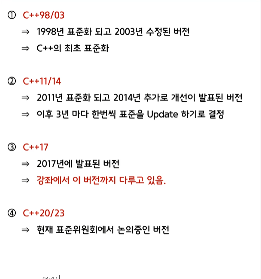
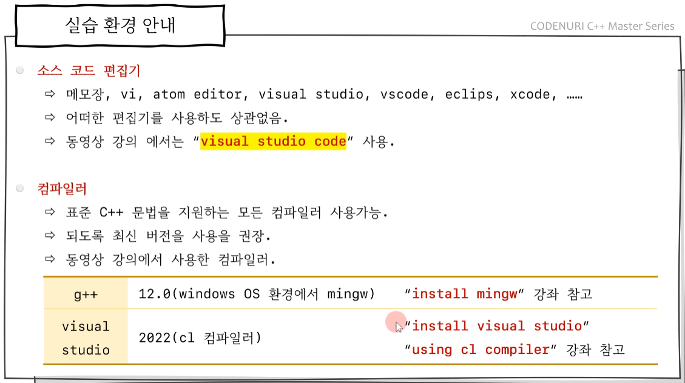
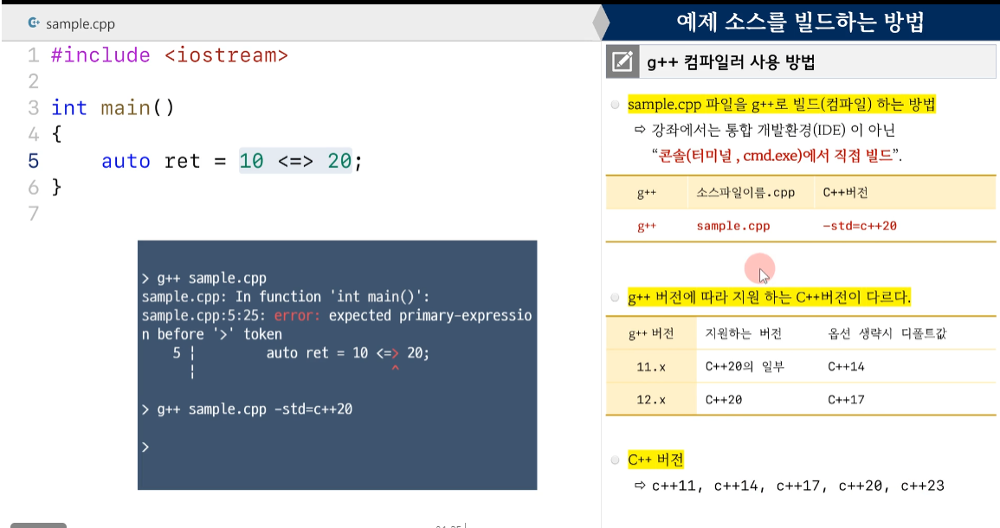
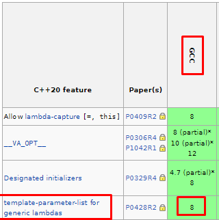
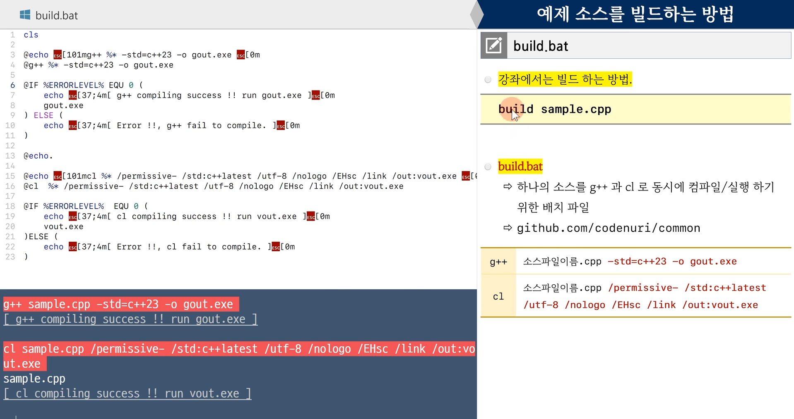
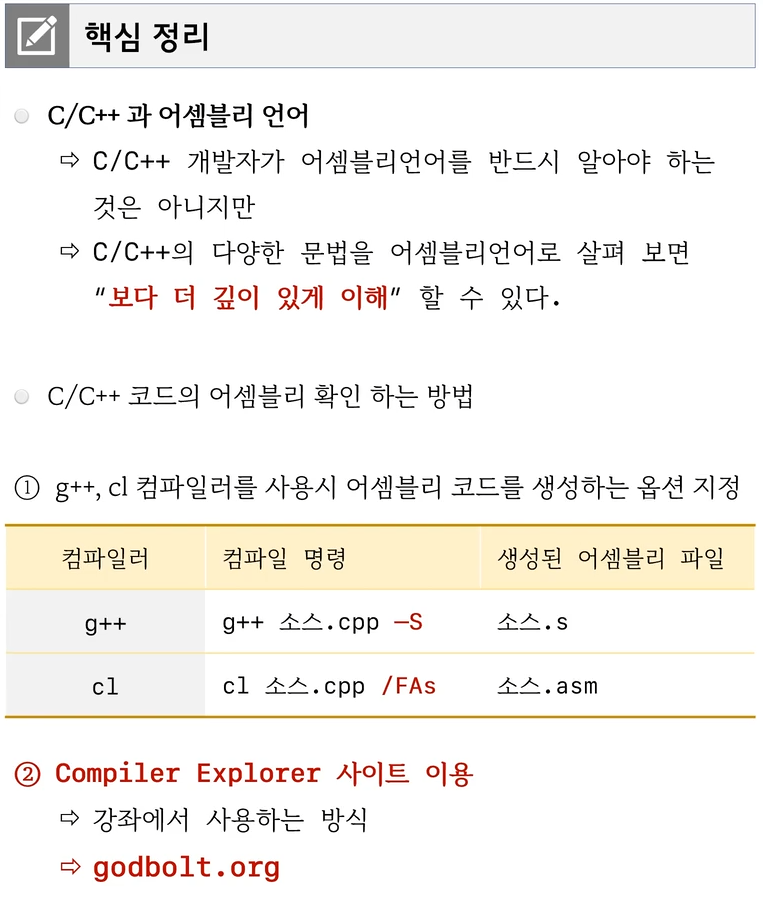

# 참고하면 좋은 사이트

`cppreference.com`

- 최신 트렌드도 잘 반영되어 있음

`isocpp.org`

- c++ 에 대한 기사들도 나옴
- features - current iso c++ status 에서 업데이트 근황을 볼 수 있음 살짝 정리하자면 다음과 같음



# 실습 환경



- 편집기로는 vscode를 사용하고 컴파일러는 visual studio(cl compiler)를 사용해도 전혀 상관 없다.
- 컴파일러는 최신 문법을 지원하는 최신버전을 사용하자



- 컴파일러 버전에 따라 지원하는 c++ 문법이 다르다. 그리고 특정 c++을 지원하는 특정 g++ 버전을 사용하더라도 옵션을 고려해 줘야 할 수도 있다. 예를 들어 위 예제는 12.x 버전의 g++을 사용했고 이 컴파일러는 c++20까지 지원하지만 옵션을 주지 않으면 c++17까지 밖에 지원이 되지 않기에 컴파일 에러가 났다.



- 버전 관련 정보는 Compiler Support에서 볼 수 있다. 표가 나오는데 표 보는 법을 살펴보면 해당 c++20 기능은 gcc 8부터 지원한다는 뜻이다.

```
g++ sample.cpp -std=c++20
cl  sample.cpp /std:c++20
cl  sample.cpp /std:c++latest <- cl 컴파일러의 경우 이렇게 하면 컴파일러 버전이 지원하는 가장 최신의 문법을 적용한다.
```

`생성파일`

- g++로 컴파일 하면 원도우의 경우 a.exe, linux의 경우 a.out 파일이 생성된다.
- cl compiler로 컴파일 하면 윈도우의 경우 소스코드.exe 파일이 생성된다.

`배치파일`



- 강좌에서는 두 컴파일러를 비교하기 위해 두개 다 돌려볼건데 이를 편하게 하기 위해 배치 파일을 사용할 거다.

`어셈블리 코드`


- 어셈블리 코드를 보기 위해서 두가지 방법이 있다. 첫번째는 옵션을 주어 어셈블리 코드를 생성하는 방법이고 두번째 방법은 위 사이트에 들어가는 방법이다.
- 사이트에 들어가면 언어와 컴파일 버전을 고를 수 있고 컴파일 옵션도 줄 수 있다. 또 output을 누르면 실행 결과도 바로 볼 수 있다. 참고로 msvc는 microsoft visual studio compiler 다.

# 각 컴파일러 설치법

`visual studio`

- 비주얼 스튜디오 깔고 검색창에 developer를 치면 다음과 같은 실행파일을 볼 수 있다. 실행하여 cl 명령어 사용하여 컴파일 하면 된다.


`gcc`

- 조금 다른게 설치 후에 c: 아래에 컴파일러 실행 파일 위치 시키고 소스 코드 위치에서 gcc 명령어를 입력하여 컴파일해야 한다.