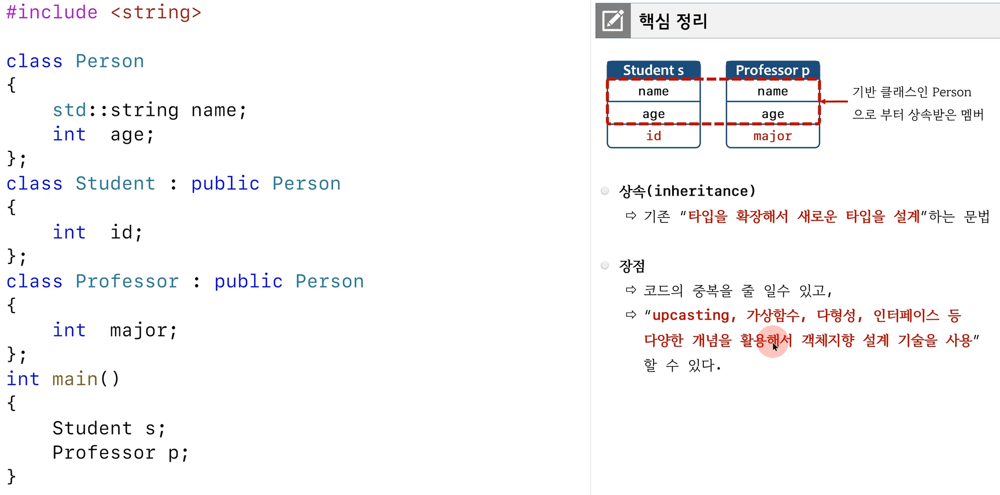
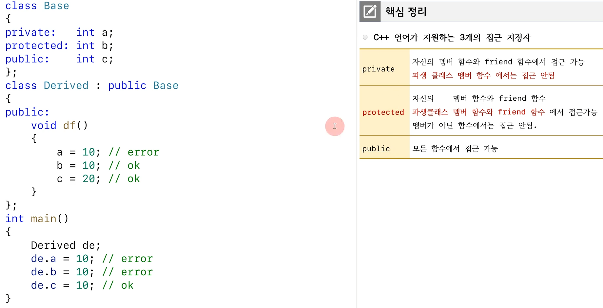
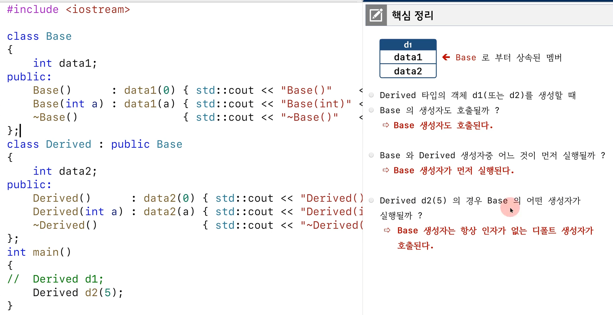
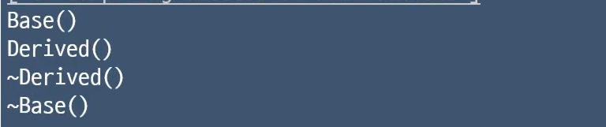
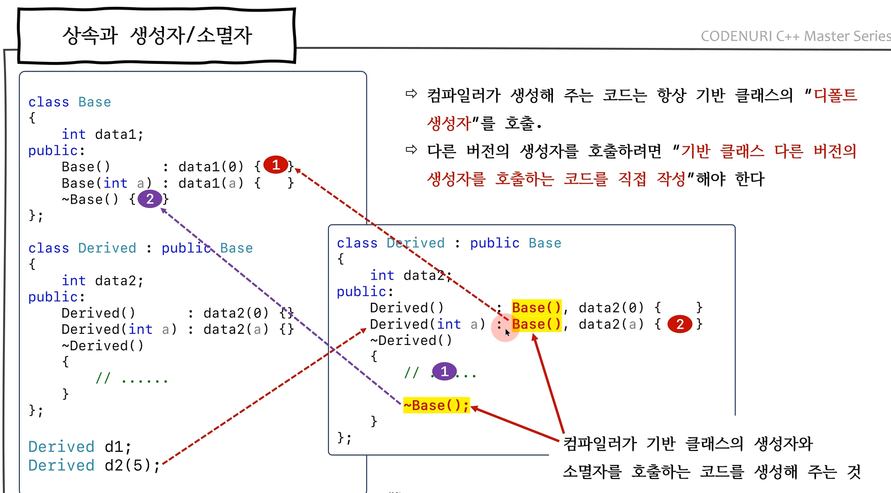
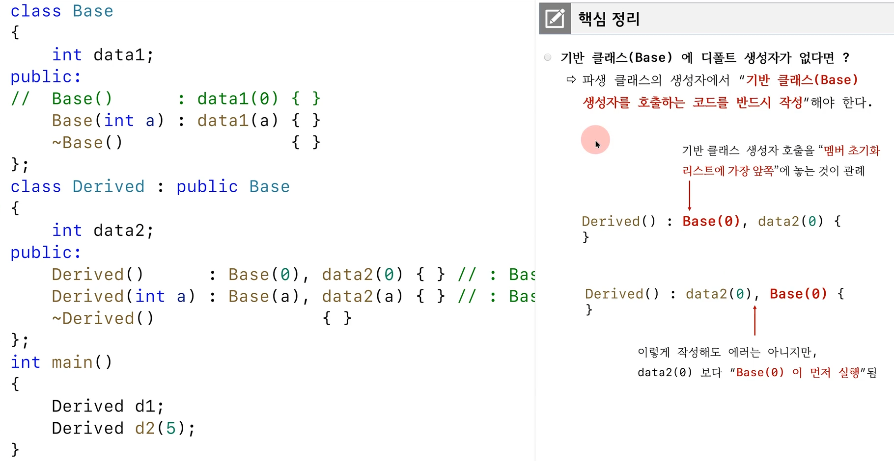
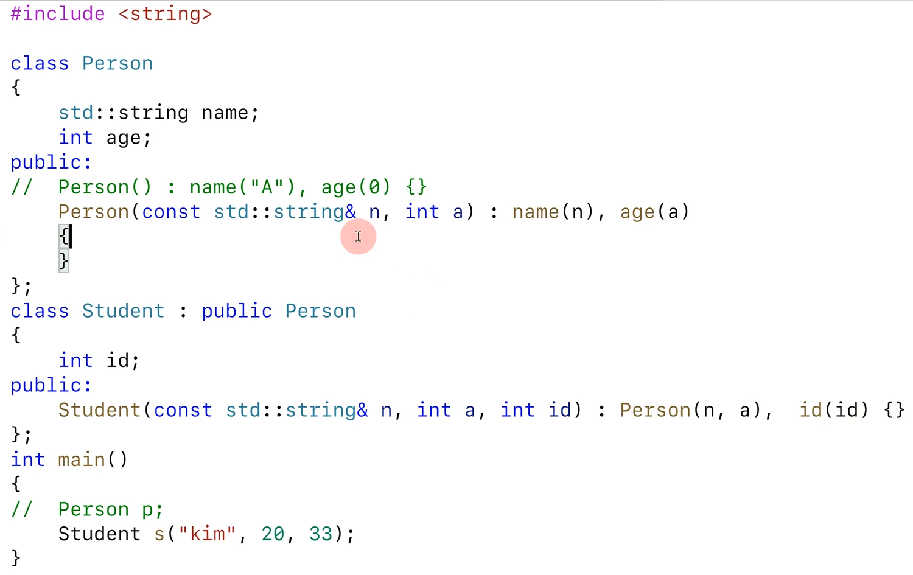
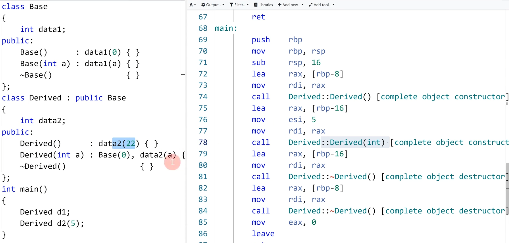

# 상속 

# 생성자 소멸자

- 하지만 자세히 보면 생성자의 경우 호출 자체는 derived가 먼저 되고 내부 로직 완료는 base가 먼저 되고, 소멸자의 경우에도 마찬가지로 호출 자체는 derived가 먼저 되고 끝나기 전에 base소멸자가 호출 되는 것이다.

- 나이와 이름이 없는 사람은 없음. 그렇다고 초기화시 다 같은 값으로 초기화 시키면 또 로직상 이상함. 즉, 디폴트 생성자가 없는 클래스도 많이 있다. 무조건 인자로 받게 하는 경우, 또 이러한 클래스를 부모로 가진 경우 다음과 같이 하면 됨.

- 호출 자체는 자식게 먼저 되는데, 생성자의 경우 바로 부모 생성자가 연이어 호출되고 소멸자의 경우 내부 로직 후에 부모 소멸자가 호출된다.