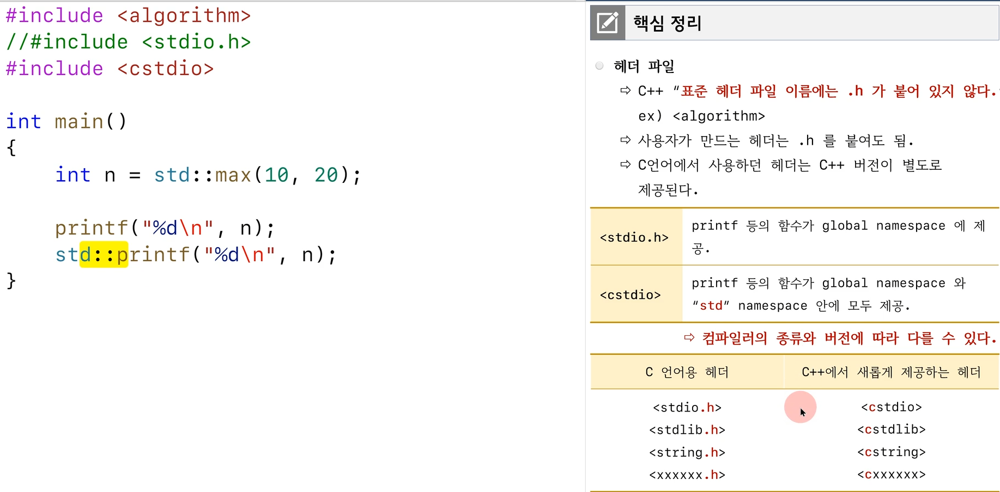
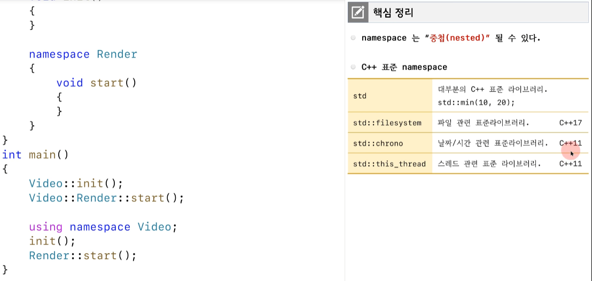
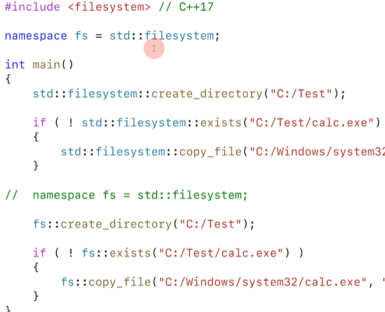
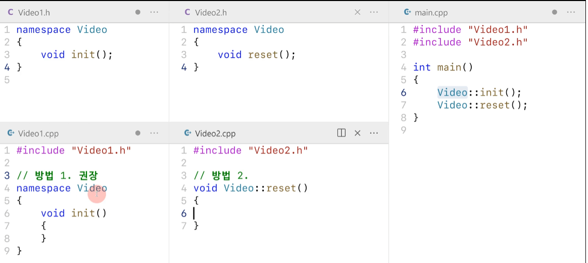

## concept

- 그런데 만약 Video의 init도 선언을 한다면 (using Video::init) init()을 호출했을때 함수이름이 충돌되어 컴파일 에러가 발생한다. 그러므로 주로 첫번째 방식(완전한 이름)을 사용하자

- 복잡하니 웬만하면 완전한 이름을 사용하자

## about std

- 위 코드는 에러가 난다. 방법을 해결하기 위해 세가지 방법이 있다.

- 세번째 방법은 추천하지 않는게 std를 다 열어버리면 내가 앞으로 만들 함수, 변수 이름들과 충돌될 가능성이 있다.

- 위와 같이 코드를 작성했을때 헤더로 stdio.h를 사용하면 cl 컴파일은 잘 되지만, gcc의 경우 컴파일 에러가 난다. 표준은 cstdio 헤더를 포함시켜 주어야 한다. 

## namespace 중첩

namespace는 중첩해서 쓸 수 있으면 c++에서 사용하는 표준 namespace는 다음과 같다.

## namespace 별칭

다음과 같이 별칭을 붙여 좀더 간결하게 사용할 수 있다. 함수 안이든 밖이든 상관없다.

# dd
여러개의 파일에 같은 namespace를 사용할 수 있다.

방법2 는 클레스와 혼동될 수 있으므로 되도록이면 1을 사용하자