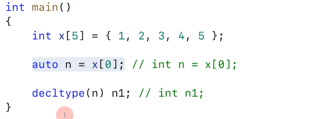
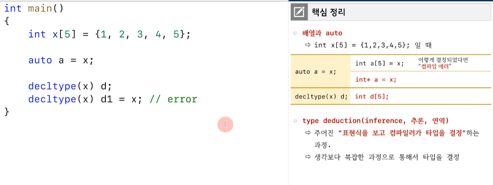
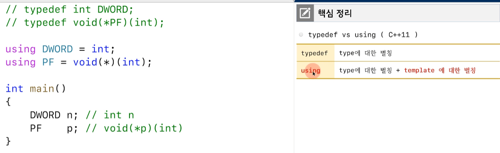
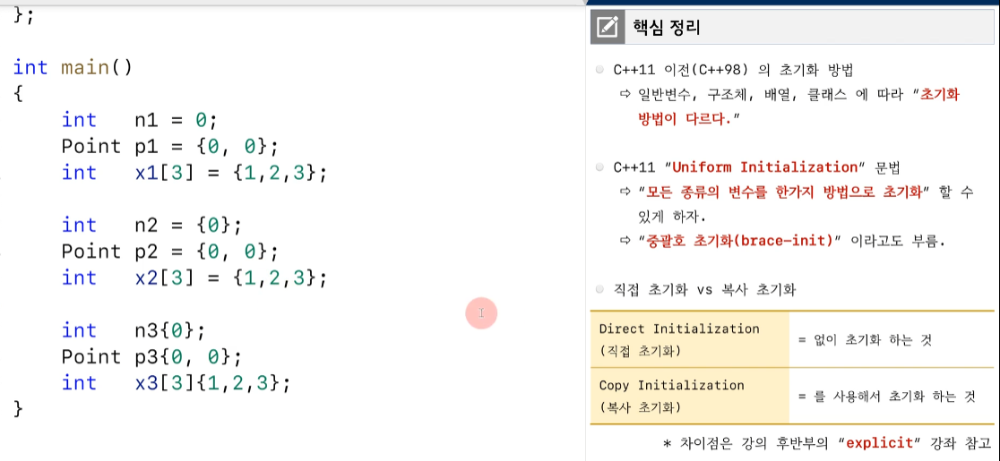
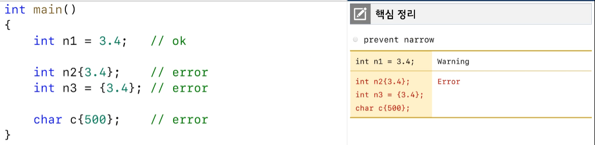
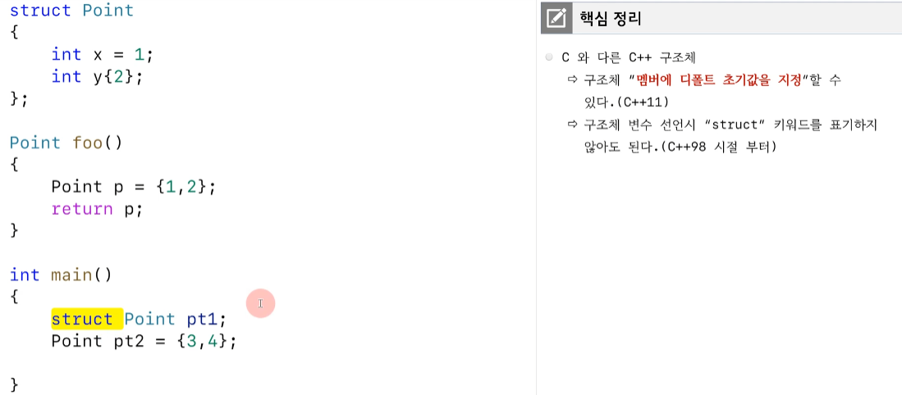
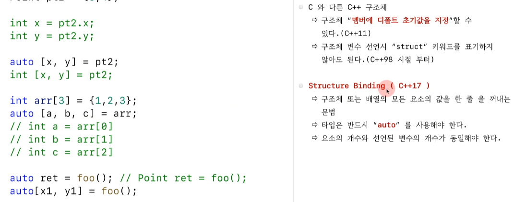
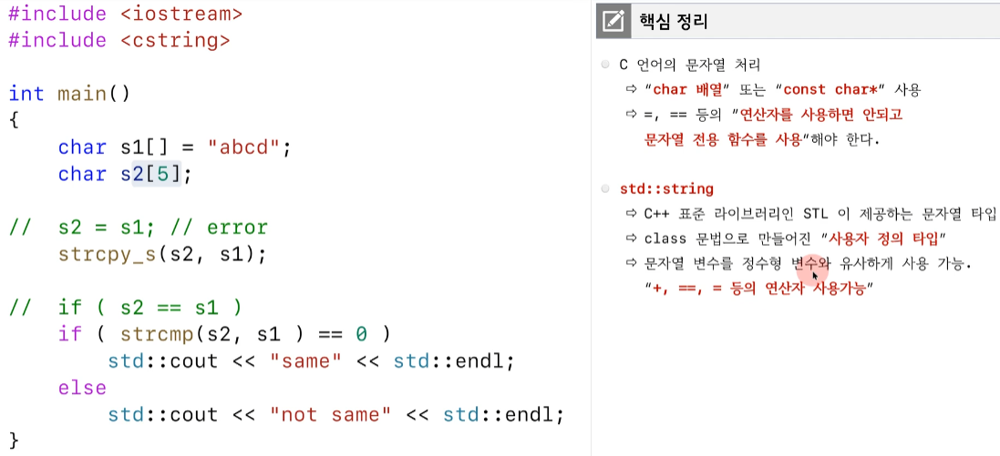
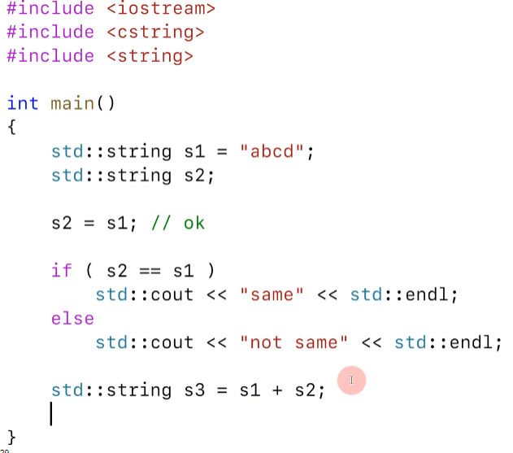
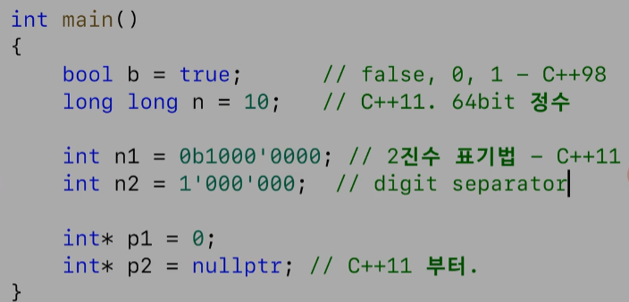

# auto

- 우변의 표현식을 조사해서 컴파일 할때 결정됨, 실행할때 경정되는 것이 아니다. 고로 성능에는 상관 없다.

`장점`

- 타입이 복잡할 경우 auto로 두면 만사 해결
- 특정 식에서 타입을 바꿀 경우 연달아 다른 곳도 바꿔줘야 하는 경우가 생기는데 자연히 해결

`단점`

- 가독성이 떨어짐. 직관적이지 못함

# decltype

- auto와 유사하다. 가로 안의 표현식으로 타입을 결정. 우변을 보고 결정(auto)하는 것은 아니므로 초기값은 있어도 되고 없어도 된다.
- 함수(클레스) 템플릿 등을 만들때 주로 사용된다.

# auto & decltype with array

우항에 다른 배열의 이름이 왔다고 생각해 보면 편하다. decltype의 경우는 초기값이 없어도 되기 때문에 이 경우에는 실제 배열이 생성된다. 실제 배열 초기화 할때 우항에 배열이름이 오면 컴파일 에러가 나고 여기에도 동일하게 적용된다.

# using

typedef로 충분한 것 아님? 나중에 템플릿 같은 곳 보면 쓸 곳이 있음.

# uniform initialization

클래스 초기화에도 적용할 수 있다.

단 이 초기화 방식은 기존 c 스타일 초기화 방식과는 다르게 위 식들이 에러로 뜬다. 이게 에러가 뜸으로서 더 안전하다.

멤버변수에 = 을 붙여 default 초기화를 할 수 있다. {}도 마찬가지로 사용 가능 

# structure binding

# 문자열

# c++에서 추가된 특징

