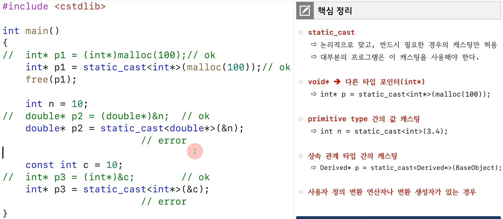
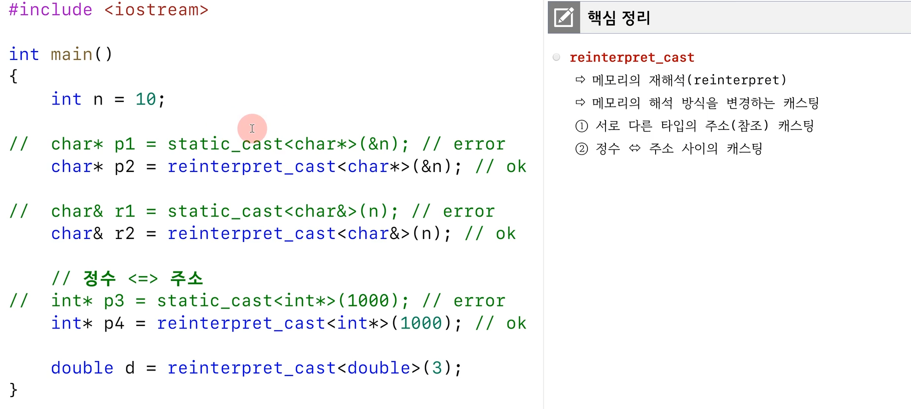
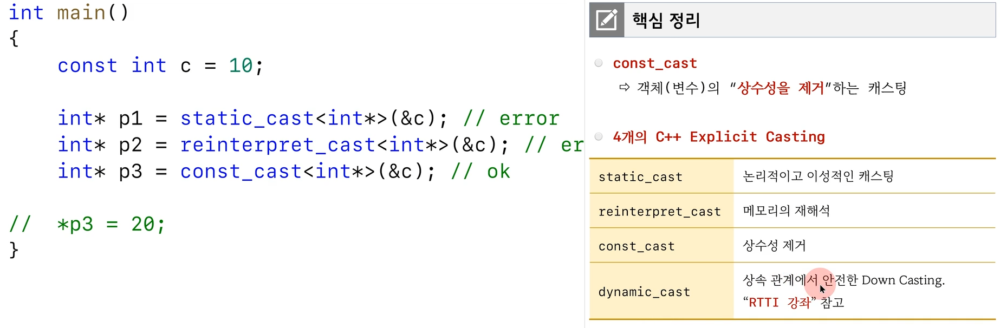
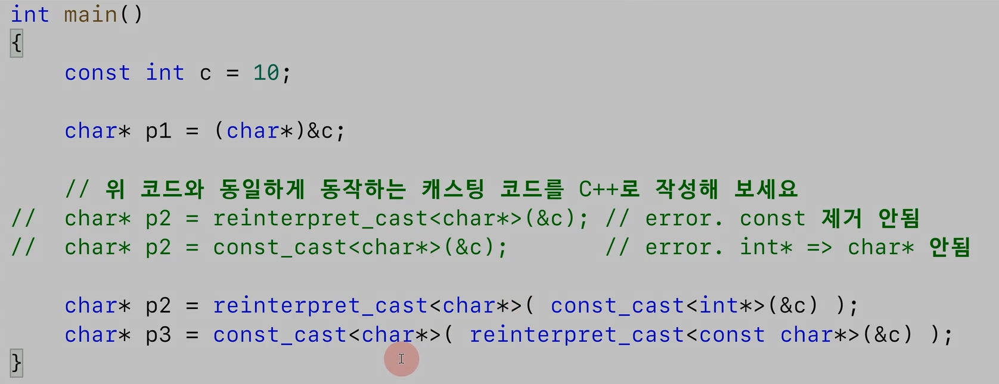

# 형변환

`static_cast`

- c 방식의 형변환은 너무 위험. 의도한 건지 실수한 건지 알 수 없음
- primitive type간 캐스팅은 사실 하지 않아도 되긴 함
- static cast를 사용하면 너무 위험한 경우는 캐스팅 되지 않고 컴파일 에러가 남.

`reinterpret_cast`

- static cast에서 안 되던 것들이 됨. 하지만 반대로 static_cast에서 되던 것들이 안 됨

`const_cast`

- 상수성 제거

`예제`

