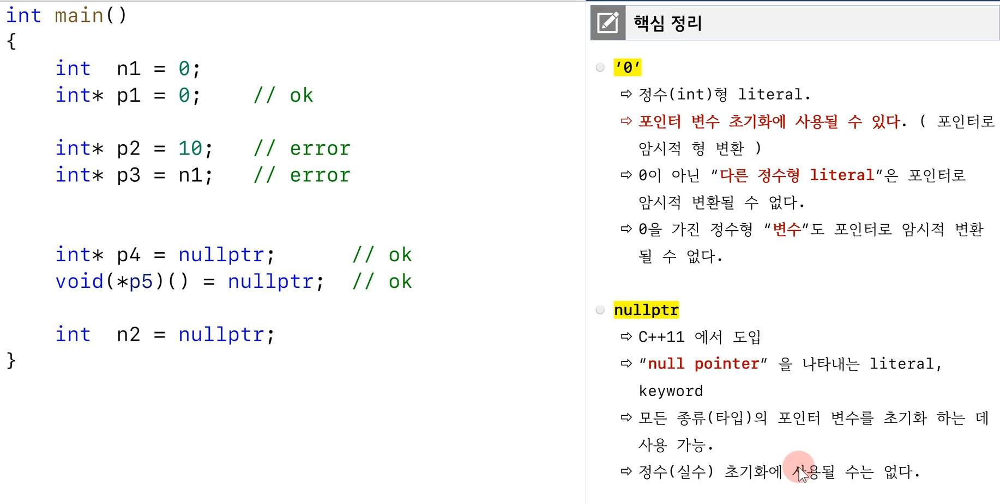
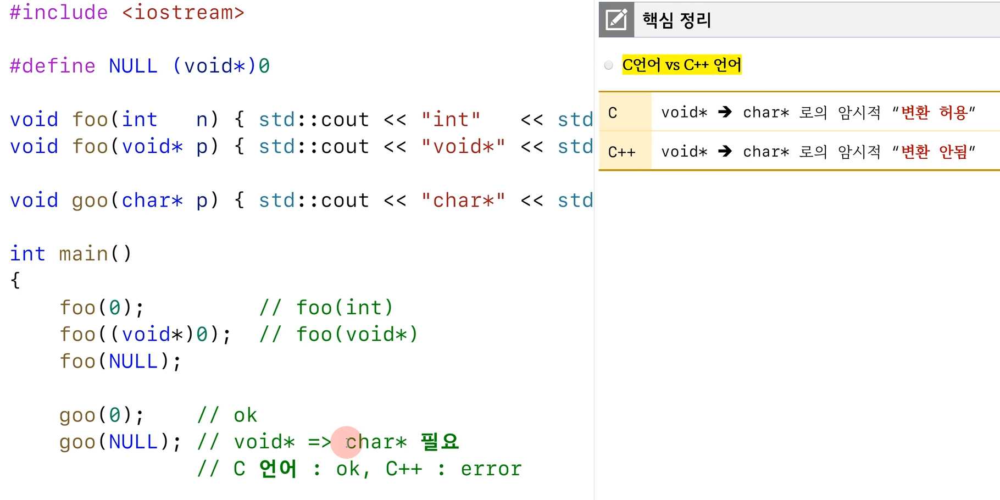
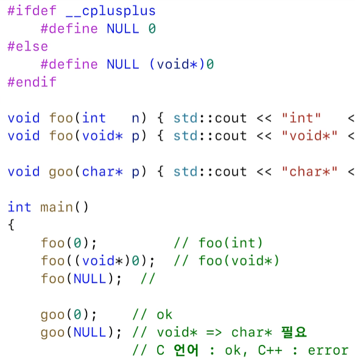
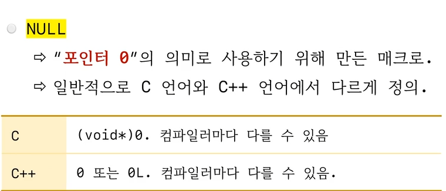
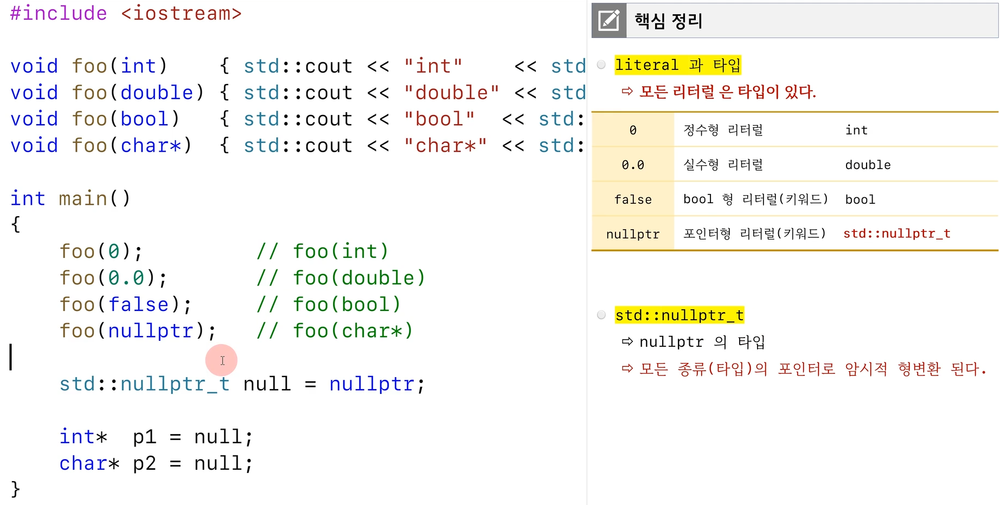
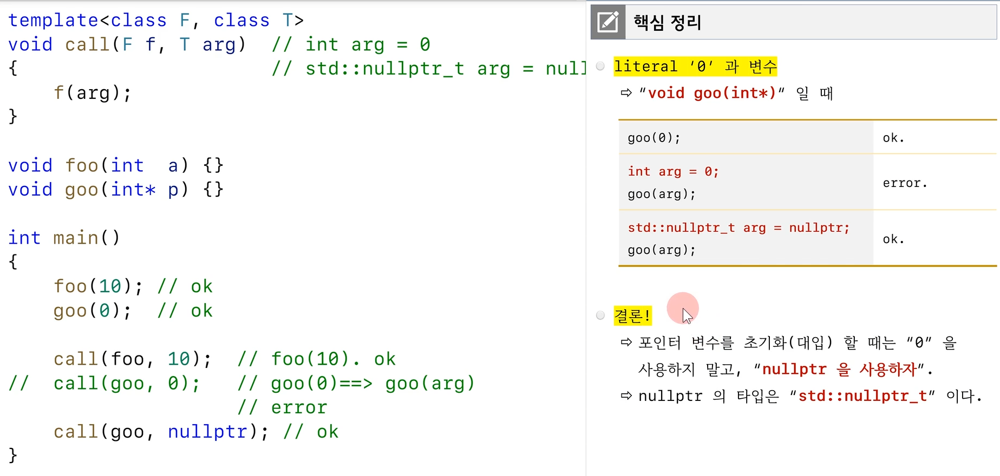
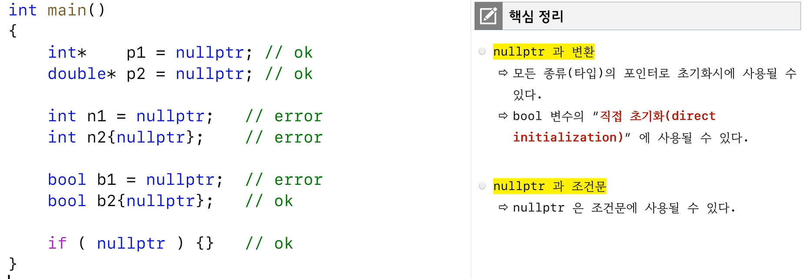

# nullptr

- 포인터 변수를 사용할때 0을 사용하지 말고 nullptr을 사용하자

# 굳이 필요할까? NULL매크로가 있는데?

- goo에서 c++의 경우 에러 그래서 다음과 같이 매크로 수정

- 근데 그러면 이번엔 foo(null)에서 int버전 foo가 호출됨. 그래서 일부로 에러내기 위해 매크로가 0L로 정의되기도 함(이 경우는 모호해서 에러가 나버림). mvsc는 0으로 되어 있고 gcc는 0L로 되어 있음.

- 결론은 0이란 매크로로는 한계가 있다는 것. nullptr을 사용하면 문제 없음. foo(nullptr), goo(nullptr) 모두 문제 없이 작동함

# nullptr type

- if문에 넣었을때 에러가 나지 않기 위해서 bool타입 직접 초기화는 허용된다.