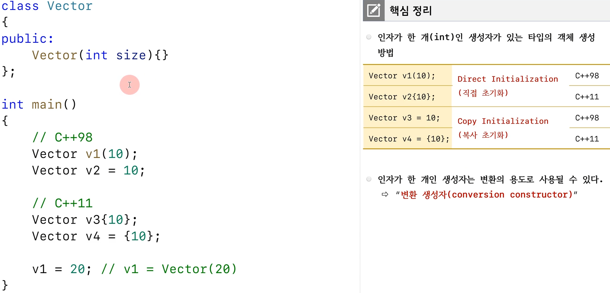
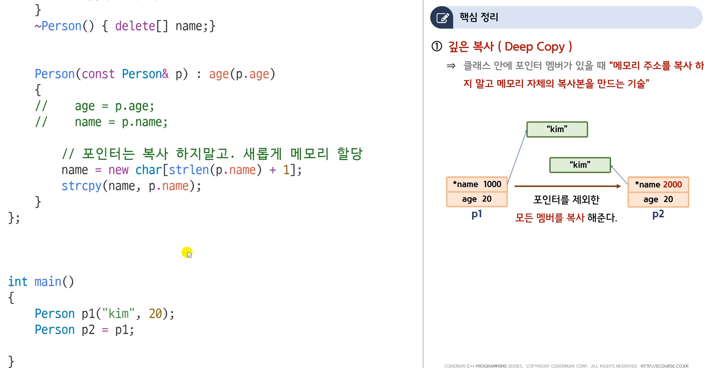
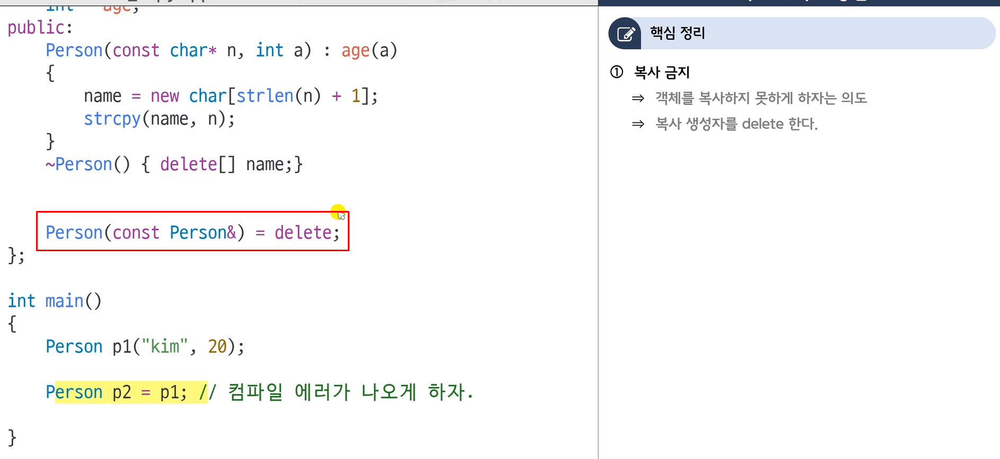

# class 

`struct`

`객체 정의`

`객체와 메모리`

`접근지정자와 캡슐화`

`생성자 소멸자`

# 멤버 데이터 초기화

`member initializer list vs at constructor`

- int같은 premitive type의 경우는 큰 차이가 없음

`should use member initializer list`

`member initializer list 사용시 주의사항`

`member initializer list with defualt member initializer`

# explicit

# 복사생성자

- 사용자가 만들면 안 만든다.

- 원래라면 아래 4개는 복사생성자가 호출됨. 하지만 explicit 키워드를 복사생성자에 넣었기 때문에 복사초기화는 불가능 -> 아래 두개 컴파일 에러

`얕은 복사`

`깊은 복사`

`ref count`

- 멀티스레드 환경에서 깊은 복사보다 더 성능이 안 좋을 수 있다.

`복사생성자 사용 못하게`

`문자열의 경우 걍 string 사용`

