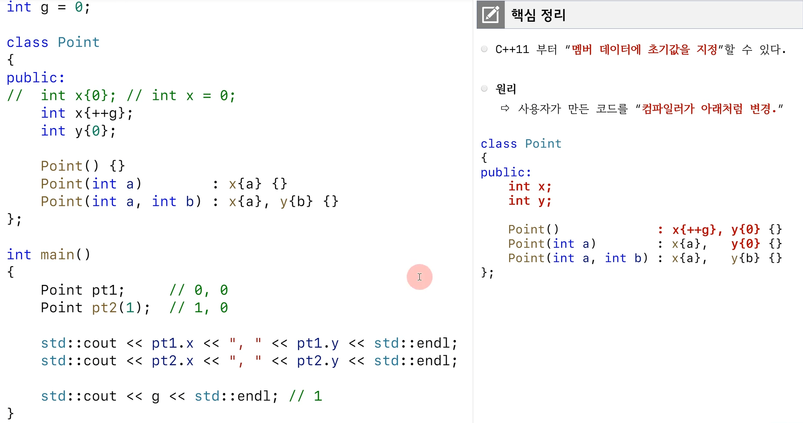

# class 

`struct`

`객체 정의`

`객체와 메모리`

`접근지정자와 캡슐화`

`생성자 소멸자`

# 멤버 데이터 초기화

`member initializer list vs at constructor`

- int같은 premitive type의 경우는 큰 차이가 없음

`should use member initializer list`

`member initializer list 사용시 주의사항`

`member initializer list with defualt member initializer`

# explicit

