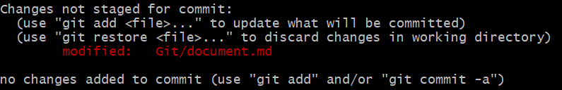

## 깃 저장소 만들기

#### 내 로컬에서 처음 시작

1. 원하는 로컬 폴더 안에 들어간다.
2. `git init`
3. `git add 폴더/파일`
4. `git commit -m "day1"`

#### 다른 저장소에서 받아오기

1. `git clone https://github.com/NoYoungRea/AfterNC`

#### 수정하고 저장소에 저장하기

  

파일 처음 생성하고 add를 하면 Untracked 상태에서 Staged 상태로 변한다. 비로서 Staged 상태가 되야만 commit을 할 수 있다. 기존 tracke 하고 있는 파일을 수정하면 modified 상태로 변한다. 아직 Staged 상태가 아니기 때문에 commit 할 수 없다. Staged 상태로 바꾸려면 여기서도 add를 해야 한다.(-a -m 을 습관적으로 해서 평소에 인지 못한듯 하다)

  

#### 무시할 파일 설정
.gitignore 파일에 패턴을 적어서 특정 폴더에 놔두면 해당 디렉토리 아래에 있는 모든 폴더 파일에 적용된다.

