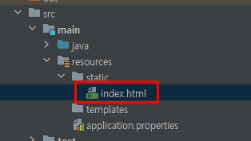
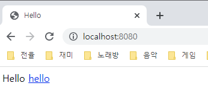
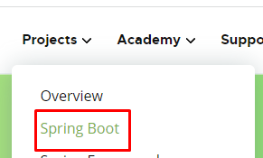
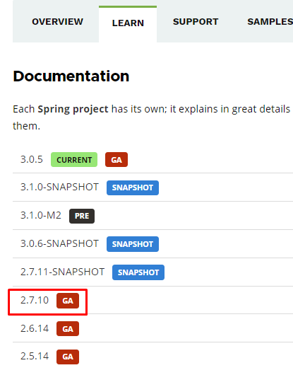
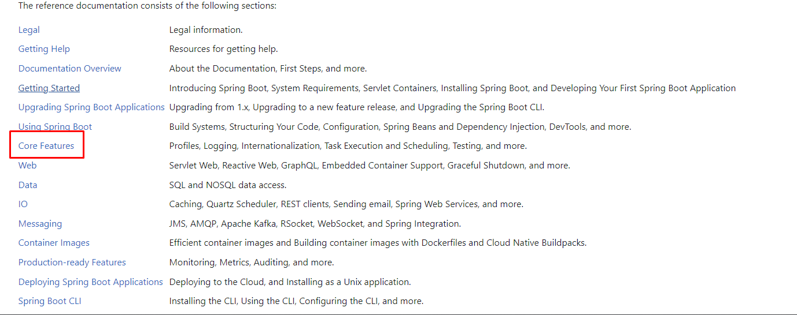
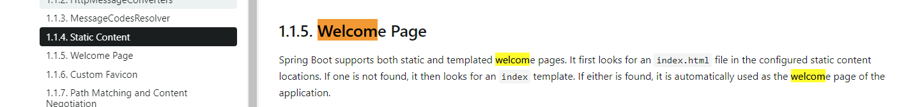
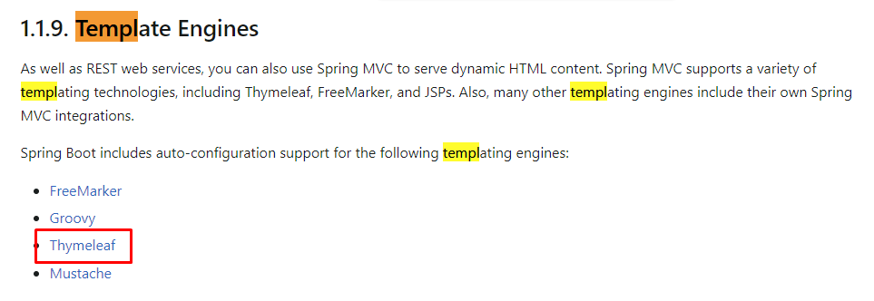
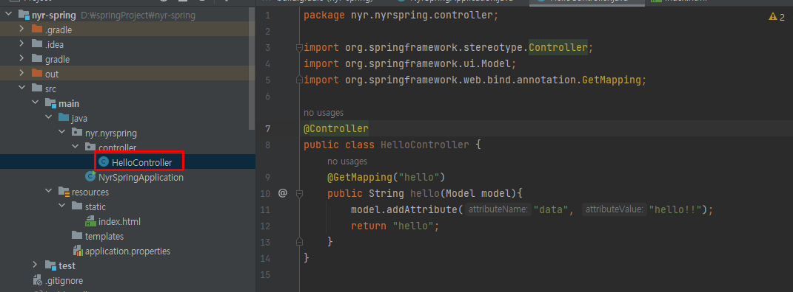
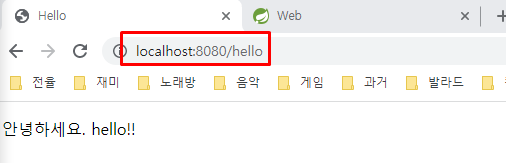
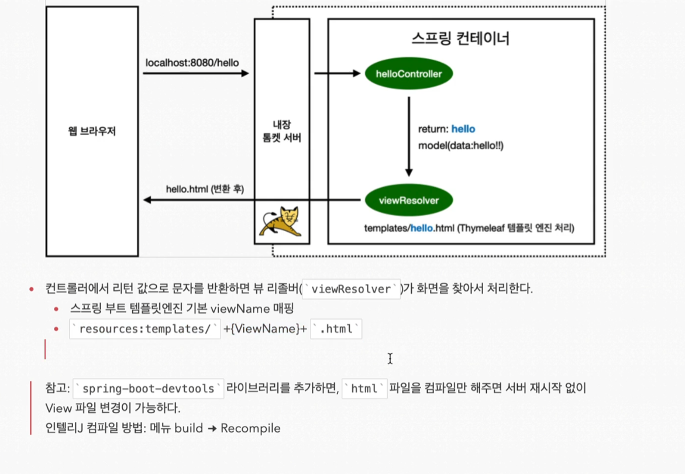

index.html은 도메인만 치고 들어왔을때 첫 화면이다. 저 static 안에 생성해주고



```html
<!DOCTYPE HTML>
<html>
<head>
 <title>Hello</title>
 <meta http-equiv="Content-Type" content="text/html; charset=UTF-8" />
</head>
<body>
Hello
<a href="/hello">hello</a>
</body>
</html>
```
다음 코드를 넣자. 실행하고 localhost로 들어가면



잘 나온다!

spring boot는 spring을 감싸 사용자들이 spring을 편하게 사용할 수 있도록 많은 것들을 제공해준다. 그 기능들은 어마어마하게 많고 필요할때마다 찾아서 사용해야 한다.

- welcompage 어떻게 하지? ->spring.io에 들어간다.






- 이런 저런 곳 찾으면 된다. 찾기 편하게 되어 있다. static에서 찾아보고 없으면 템플릿에서 찾는다고 한다. static의 경우 그냥 파일을 던져 준거다. 프로그래밍을 한게 아니다. 한번 템플릿을 이용해보자. 우리는 thymeleaf templete engine을 사용할 것이다. 사용법은 thymeleaf.org로 들어가면 된다.



- 컨트롤러를 만들어야 한다. 컨트롤러는 웹 어플리케이션의 첫번째 진입점이다. 컨트롤러 패키지를 만들고 안에다 클래스 하나를 만들자.



- 이렇게 짜면 domain/hello 로 진입하면 해당 함수를 호출해준다.
- Model은 mvc의 m이다.
- 그다음 템플릿 안에 hello.html을 만들고

```html
<!DOCTYPE HTML>
<html xmlns:th="http://www.thymeleaf.org"> -- 이렇게 넣어주면 이제 타임리프 엔진의 문법을 사용할 수 있다.
<head>
 <title>Hello</title>
 <meta http-equiv="Content-Type" content="text/html; charset=UTF-8" />
</head>
<body>
<p th:text="'안녕하세요. ' + ${data}" >안녕하세요. 손님</p> -- 이 data부분을 서버에 요청하는 듯 하다.
</body>
</html>
```

다음을 복붙한다. 실행하면



잘 나온다! 정리해보면



- spring boot가 내장한 톰켓서버에서 /hello를 받으면 Get방식으로 요청했으니 이에 맞는 GetMapping이 있는지 살펴본다. 있다면 해당 맵핑된 함수가 실행이 된다. 실행될때  spring이 인자로 model을 넣어주는데 여기에 key : data, value : hello!! 를 넣어준다. 그리고 hello를 리턴한다. 그럼 viewresolver가 resources에 templates 안에 있는 hello.html을 찾아 model을 토대로 렌더링 해준 후에 이를 클라로 전송해준다.
- (인텔리제이 엔터프라이버전에서는 return hello를 컨트롤 클릭하면 hello.html로 넘어간다.)