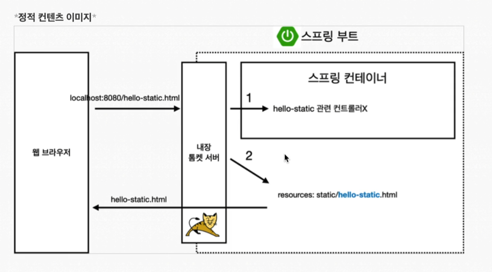
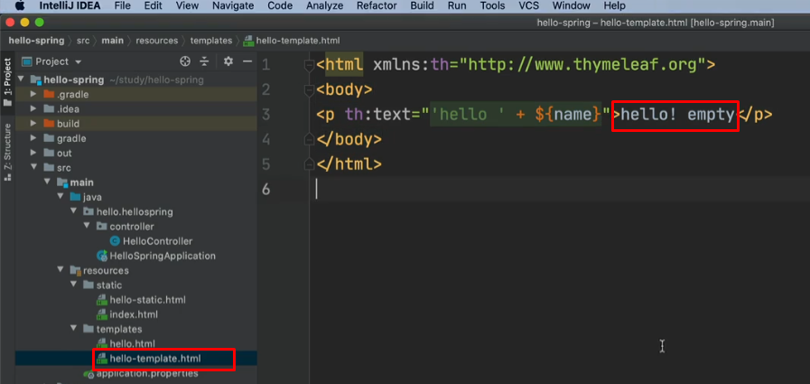
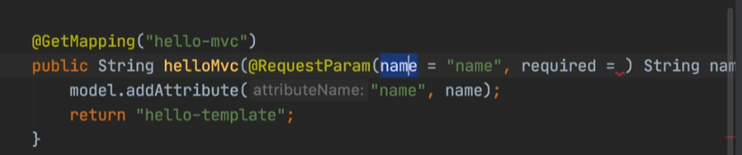
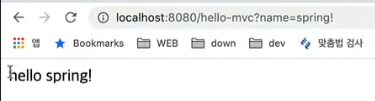
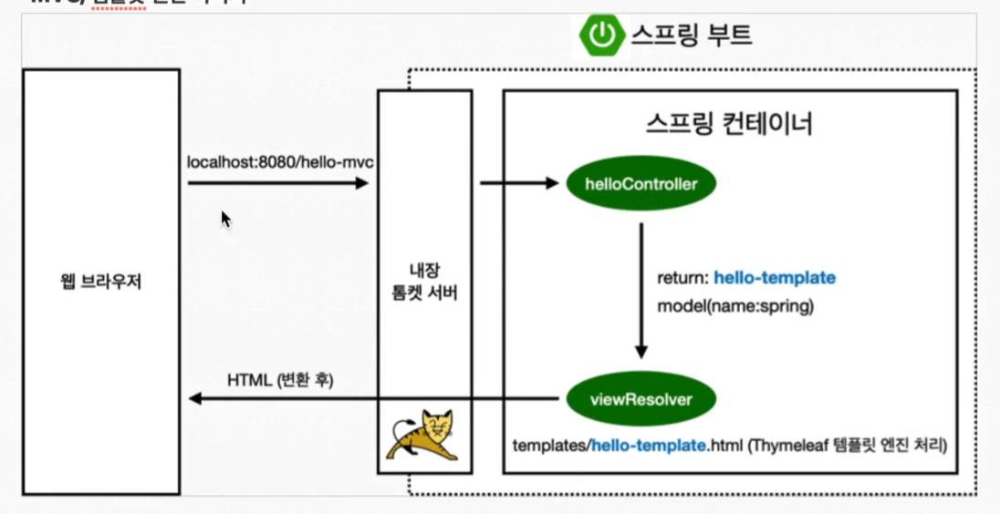

# 웹 개발 

정적턴컨텐츠 : 파일을 그냥 내려주는 것(예제에서 해봄) 
mvc와 템플릿 엔진 : html을 그냥 주는게 아니라 서버에서 동적으로 할당애 주는 것(예제에서 해봄. 최신 패턴)
api : 만약에 우리가 안드로이드나 아이폰을 클라이언트로 개발을 해야 한다면, 서버 입장에서는 html이런걸 전달해주는 것이 아니라 json(옛날에는 xml)포맷으로 내려준다. api로 데이터만 내려주면 화면은 클라이언트가 알아서 그리는 것이다. 또 서버끼리 통신할때도 사용한다. 서버끼리 통신할때는 html을 내려줄 필요가 없다. 어떤 데이터가 왔다갔다 하는지가 중요하기 때문에 api 방식을 사용한다.

## 정적 컨텐츠

- 전 실습에서 html파일을 static에 넣고 해봤다.

## mvc와 템플릿 엔진

mvc : model, view, controller

과거에는 view와 controller가 분리되어 있지 않았다. 과거엔 jsp를 가지고 view로 모든 것을 다 했다. 과거 jsp 파일 하나가 수천라인 일때도 있을다. view에서 db도 접근하고 비지니스 로직도 다 있고 지금은 책임과 역활일 분리된 방식(mvc)이 기본이다.

`view`

templates 폴더에 html하나를 만들고(본문의 빨간 박스는 서버에 요청하지 않고 그냥 파일을 봤을때 기본값이라 보면 된다.)

`controller`

컨트롤러 구성은 다음과 같이 했다. required를 true로 하면 값을 무조건 요청해야 하고, false로 하면 하지 않아도 된다. default값은 true로 되있다.

`요청`

- 전에 한 예제랑 다른 것은 요청하는 값을 추가해봤다.

 