# 프로젝트 생성

start.spring.io 

- 여기로 들어가서 다음과 같은 설정으로 프로젝트를 설정한다.

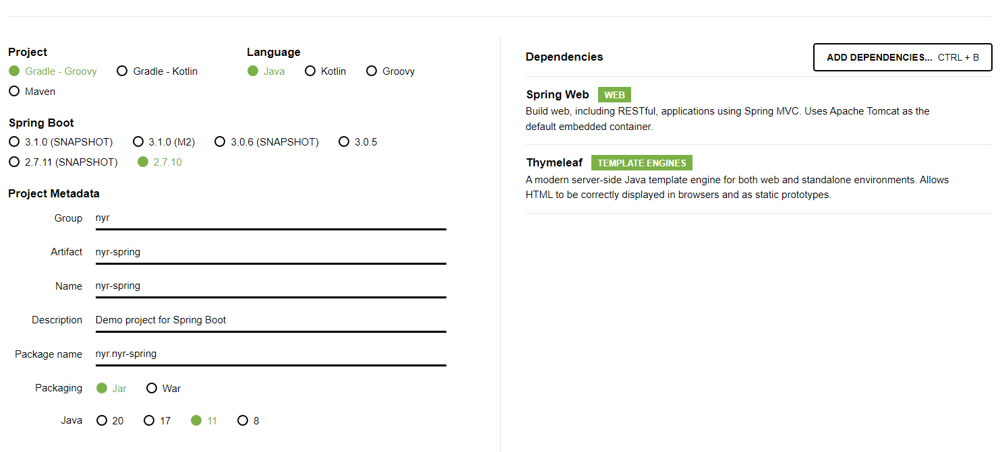

- 설정후 제너레이트 하면 폴더가 나오는데 인텔리제이에서 여기 안에 있는 build.gradle을 연다.

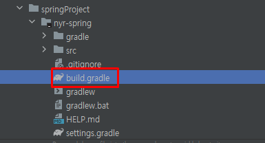

- build.gradle을 눌러보면 다음과 같이 아까 설정했던 것들이 다 들어가 있다. 옜날에는 이걸 한땀한땀 적었는데 이런식으로 위 사이트를 이용하여 간편하게 스타트할 수 있다.

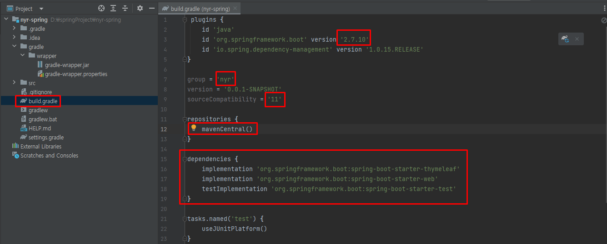

- mavenCentral()의 경우에는 아래 dependencies를 다운 받을 곳이다.
- gitignore의 경우에도 소스코드만 올라가기 위해 옜날에는 다 적어줬는데 위 방식대로 하면 자동으로 만들어준다.
- .idea는 인텔리제이가 사용하는 설정파일이다.

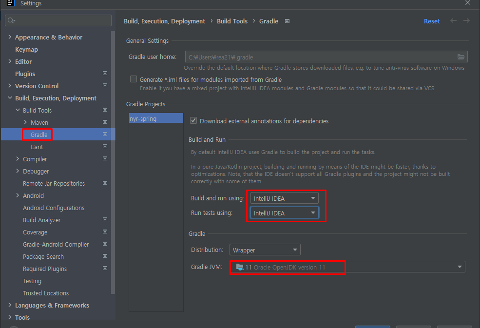

- jdk내가 깐거 설정해 주고, 저거 gradle로 되어 있는 건 intelij idea로 바꾸어주자. 안 그러면 gradle을 통해서 실행되기 때문에 느려진다.

- 강사말로는 켜지자마자 gradle 관련된 것들이 받아진다고 하는데, 난 안 받아져서 직접 다운 받았다.

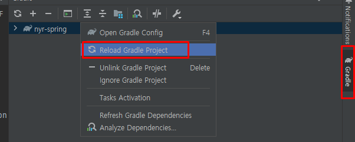

- 이제 실행이 잘 된다. sdk 깔때 따로 환경변수 이런거 셋팅은 해주지 않았다.
- 실행 후 localhost:8080에 들어가면 다음과 같은 화면이 뜬다.

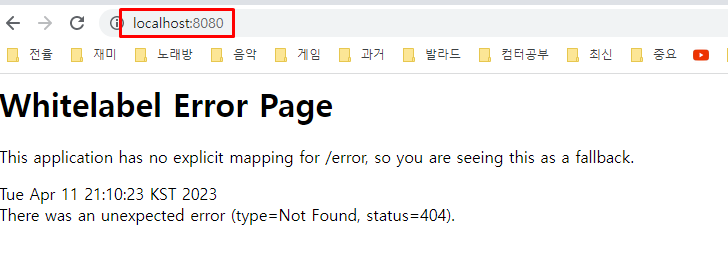

- springboot의 경우 tomcat 웹서버를 자체 내장하고 있다. 즉 저거 실행한게 서버 띄운거라 봐도 될듯.

# 라이브러리 살펴보기

우리가 가져오겠다고 한 것은 위 두개다

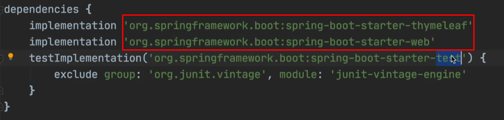

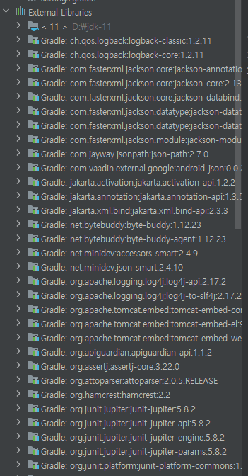

근데 external library를 내려보면 나오는 것은 다음과 같다. 우린 가져온 적 없는데? 저 많은 것들이 여기 두개에서 파생되고 파생된 것들이다. 자세한 의존 관계는 다음 창에서 파고들어가면 더 볼 수 있다.

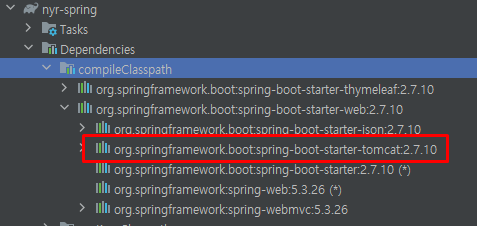

- 옛날에 개발할때는 톰켓 웹 서버에다가 소스 코드를 밀어넣는 방식으로 힘들게 개발(분리되어 있었음) 근데 요즘은 소스 라이브러리에서 웹 서버를 들고 있다. 그래서 실행만 하는데도 웹서버가 떠 버린다. 옛날처럼 톰캣깔고 ㅇㅈㄹ 하지 않는다.
- spring boot를 사용하면 spring관련된 라이브러리도 죄다 땡겨온다.
- 로그 관련 라이브러리의 경우 사람들이 많이 쓰는 걸 가져와서 starter(spring boot 관련 라이브러리 땡기면 항상 들어있다.)에 넣어놨다.

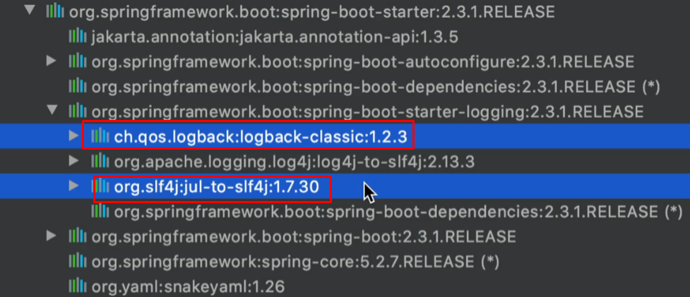

- 그리고 테스트 관련 라이브러리가 내가 넣지 않은게 하나 들어갔다. 종속성을 보면 junit을 사용하는 것을 볼 수 있다. 정리해 주신 것은 다음과 같다

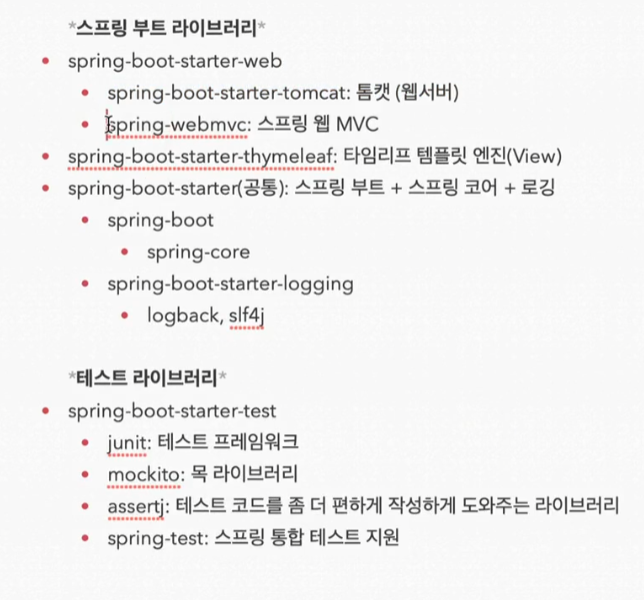