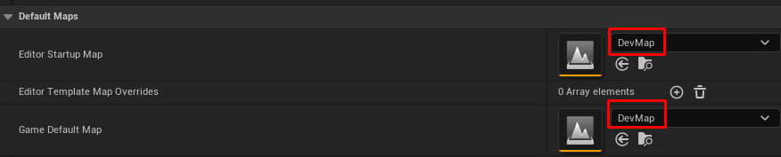
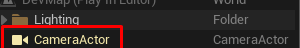
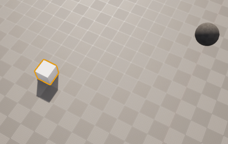

# 스타트 레벨 설정
1. ctrl+n : make new level
2. file -> save current level(ctrl+s) : save current level
3. project setting -> Maps&Modes

# 액터 배치 관련
- end : 배치된 액터를 땅에 부착시킴
- f : focus
- 오른쪽 아웃라이너에 배치 된 것들의 list가 나온다. 역할이 궁금하면 눈모양을 눌러 해당 기능을 꺼보자

# 카메라
배치를 해주지 않으면 default로 카메라가 생성된다.

f8을 통해 게임에서 잠시 빠져나올 수 있는데 그럼 생성된 카메라를 육안으로 볼 수 있다.
