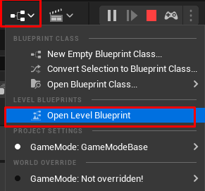
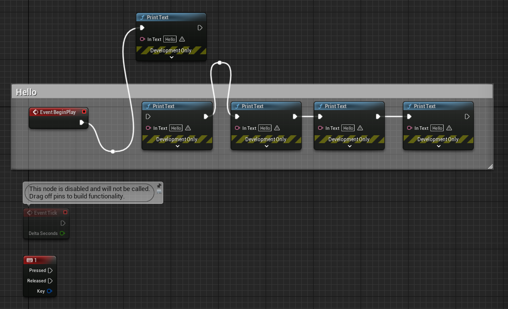

# blueprint editor

레벨마다 생성할 수 있는 블루 프린트가 있다. 모든 레벨에 통용되는 것이 아니라 레벨 마다 다 다른 블루프린트를 가지고 있다. 우선 여기서 조작을 해보자.

항상 작업 완료했으면 컴파일->세이브 해주고 플레이 하도록 한다.
ctrl + d : 노드 복사
노드들 드래그 안 영역에 놓고 c : 주석을 달 수 있다.
선을 더블 클릭하여 특정 점을 경유해서 가게 할 수 있다.
alt + 화살표 클릭 : 선 끊기
ctrl + 화살표 드래그 앤 드롭 : 선 다른 노드로 옮기기
노드들 드래그 안 영역에 놓고 q : 정렬

# 실습 사진

