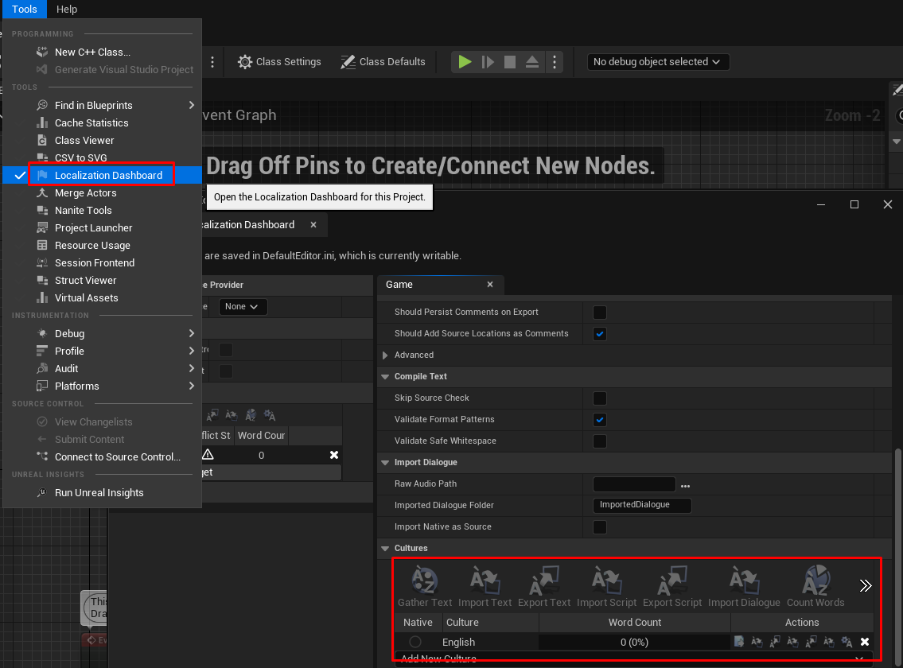
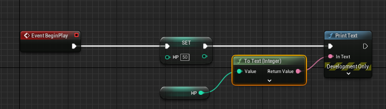

# 다양한 변수
- float : 실제 치환되는 자료형은 doubld
- Name : 빠르게 해당 문자를 찾아야 할때. 단, 변하지 않아야 한다.
- Text : 퀘스트 다이얼로그 같이 긴 곳. 또 다국어 변환이 필요할 경우 해당 타입 사용

# 변수에 따른 함수 

근데 여기는 set도 value를 리턴해주는 듯 하다(결과 똑같이 나옴) 코드 실행 순서 인자 받는 곳, 리턴 하는 곳 이 각각 어떤 모양을 하고 있는지만 인지하면 끝인것 같다.