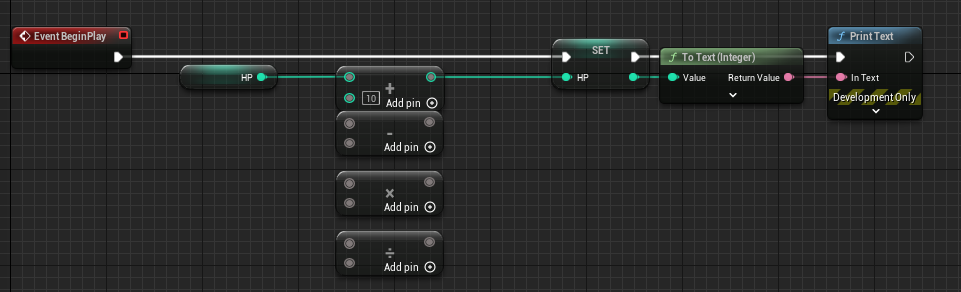
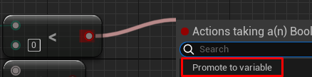
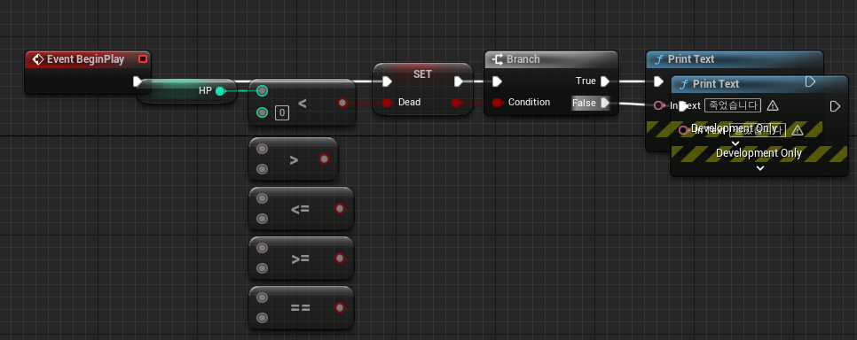
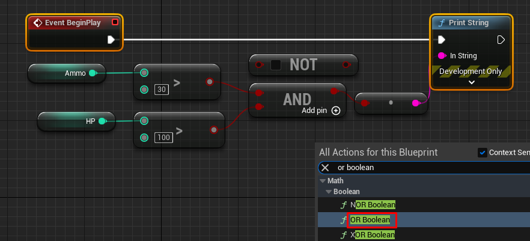
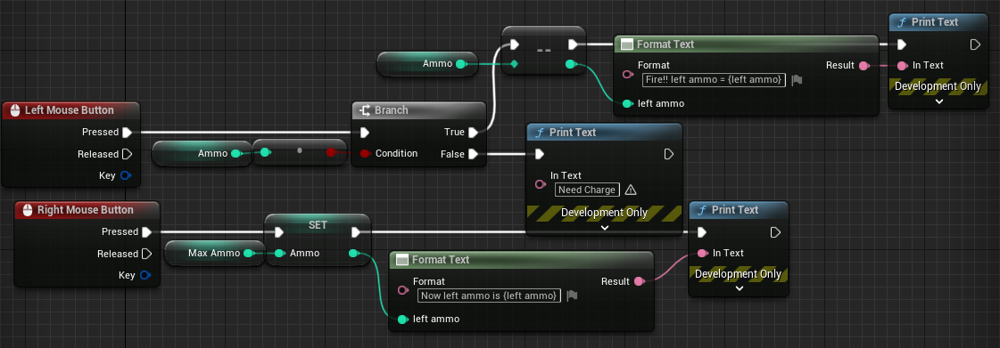
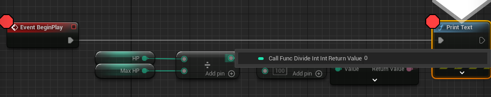

# 다양한 변수
- float : 실제 치환되는 자료형은 doubld
- Name : 빠르게 해당 문자를 찾아야 할때. 단, 변하지 않아야 한다.
- Text : 퀘스트 다이얼로그 같이 긴 곳. 또 다국어 변환이 필요할 경우 해당 타입 사용

# 변수에 따른 함수 

- 마우스 우클릭해서 함수를 직접 찾는 방법, 왼쪽 변수를 bp editor에 드래그 하는 방법(컨트롤 누르거나, alt를 눌러 get or set 지정) 등이 있다.

- 근데 여기는 set도 value를 리턴해주는 듯 하다(결과 똑같이 나옴) 코드 실행 순서 인자 받는 곳, 리턴 하는 곳 이 각각 어떤 모양을 하고 있는지만 인지하면 끝인것 같다.

# 사칙연산

들어오고 나갈때 형을 잘 봐야 한다. 나눗셈의 경우 2/3 2.0/3.0 은 다른 결과가 나온다. 그러기에 후자를 원한다면 컨버터로 정수를 플로트 형으로 바꿔서 인자로 넣어줘야 한다.

# 비교 연산와 브렌치(if)

이렇게 변수를 바로 만들 수도 있다.

# 논리 연산

# 총알 충전 예제

# debug 

- f9 : 중단점 잡기
- f10 : 다음 이동
- f11 : 함수 안 파고들기