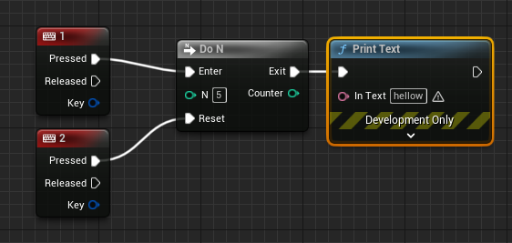

# branch

- b + leftclick : branch node

# sequence

- 가로로 너무 길어질때 가독성을 위해서
- s + leftclick : sequnce node

# flipflop

# 데미지 받고 힐받기 예제(min,max,clamp)

- 데미지 받는 것만 구현해 봤다. 그냥 생고생 한 것과 min 이용한 파트다. 힐을 받을때는 max hp를 넘으면 안 되므로 max를 사용하면 된다. 둘다 동시에 이용하는 것은 clamp 다.

# 반복문

- 코드짜는 것과 별반 다를게 없고 특이점이라면 for의 경우 마지막 인덱스 까지 포함이다. 0,5를 넣으면 0~4(코드의 경우) 가 아니라 0~5다

`구구단 예제`

# gate

`gate`

- start closed로 처음에 open 상태로 둘 것인지 close 상태로 둘 것인지 결정할 수 있다.

`multigate`

- 1을 누를 때마다 다음 인덱스로 넘어간다. random을 체크하면 임의의 인덱스로 loop를 선택하면 모든 인덱스 출력후 다시 처음부터 반복하고, 시작하는 인덱스를 지정할 수도 있다.

`do once`

- 한번열리고 닫혀버린다. 다시 열려면 reset을 호출해야 한다.

`do n`

- n번이 통과되면 닫혀버린다. reset을 통해 다시 열 수 있다. 인덱스 또한 가져올 수 잇다.(Counter)

# enum

- 이럼 이제 블루프린트 변수에서 가져다가 사용할 수 있다.

- 다음과 같이 사용가능 실제 자료형은 Byte이다.

`가위바위보 예제`

