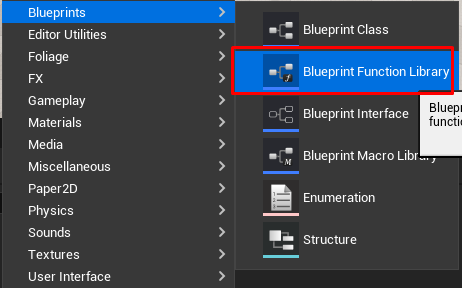
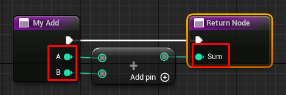
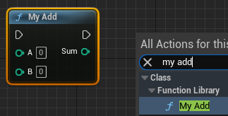
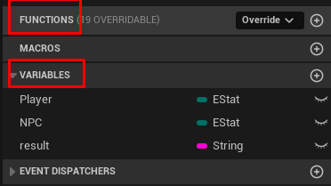
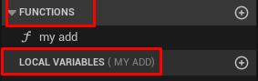
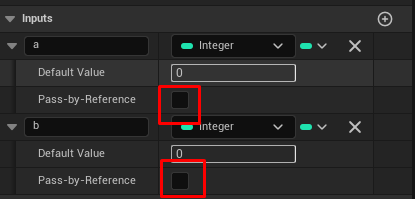
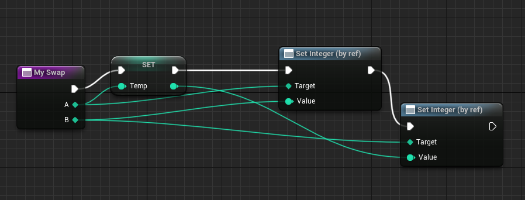
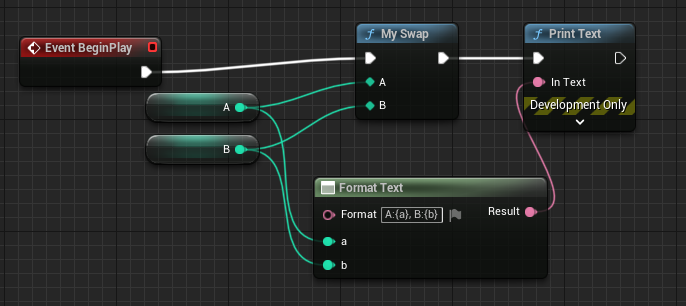
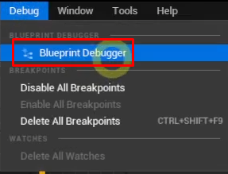
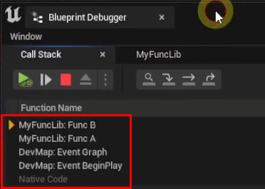

# 함수 만들기

- 여기 안에다가 만드는 함수는 전역함수 느낌인 듯?

- 이런 식으로 입력과 출력을 지정하고 그 사이 로직을 셋팅할 수 있다.

- 이렇게 만들어진 함 수는 각 블루 프린트 들에서 사용할 수 있다.

- 어 근데 여기서도 만들 수 있지 않음?(레벨 블루 프린트) 여기서 만드는 것은 멤버 변수와 멤버 함수다.

- 전역 함수와 그에 따른 지역 변수다. 그러므로 함수마다 지역변수 리스트는 다르다.

# ref with swap example

# debug 

- f9 : 중단점 잡기
- f10 : 다음 이동
- f11 : 함수 안 파고들기

- 함수에 중단점 잡았을때 콜스텍 확인하는 방법은 다음과 같다.

