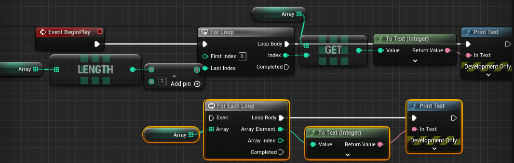
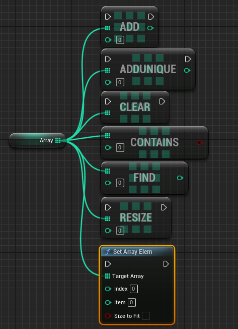
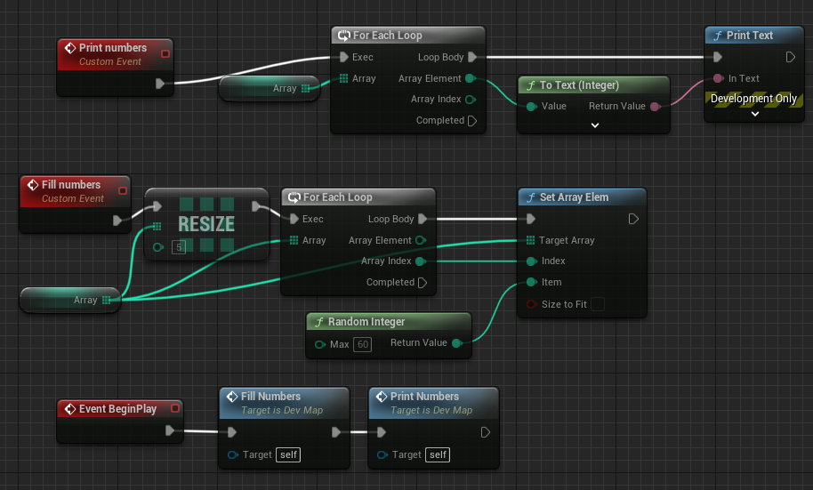
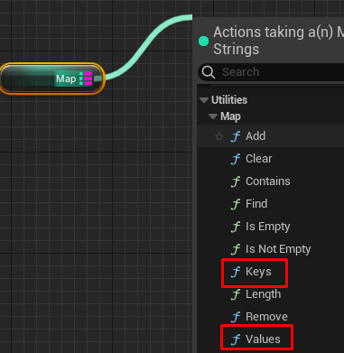
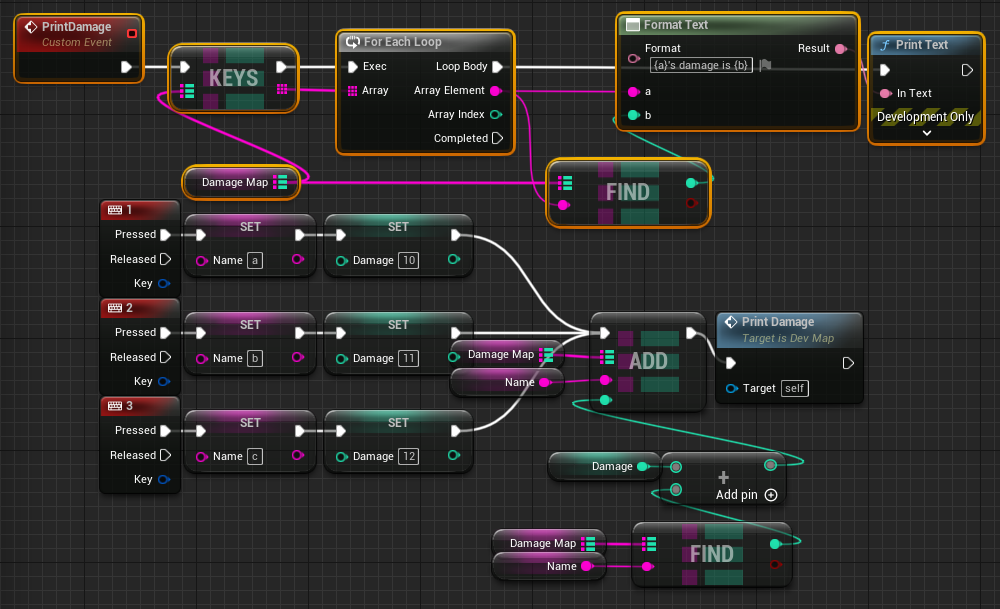

# array

언리얼에서 제공하는 array는 기본적으로 동적 배열이다.

`순회`

- 배열에서 요소 get하는 것중에도 ref로 가져올지 copy로 가져올지 결정할 수 있다.(노드가 구별되어 있음)

`다양한 노드들`

- addunique : 중첩되는 요소가 있으면 추가 안함
- contains : 있는지만 확인, bool 리턴
- find : 값을 가져옴, 없으면 -1 리턴
- set array elem : 특정 인덱스에 값 저장, 인덱스를 초과할 경우 size to fit을 설정하면 배열 길이를 알아서 늘려줌(그 사이값은 default 값인 0으로 초기화 될듯)

`로또 번호 생성 예제`

# map

- 여기 보면 순회할 수 있는 방법이 있다. keys를 순회 할건지 values를 순회할지 결정하여 노드를 선택하면 해당 노트는 해당 타입의 배열을 리턴한다.

`데미지 합산 예제`

