# 기본

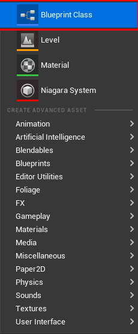

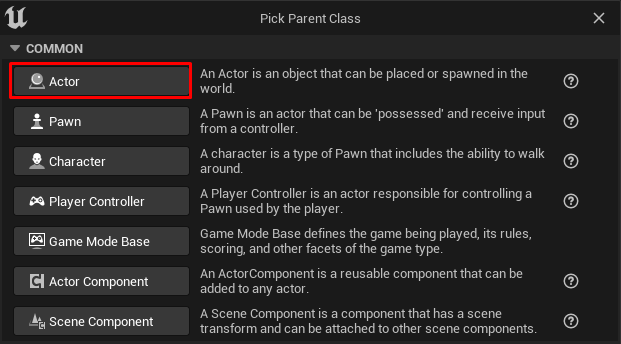

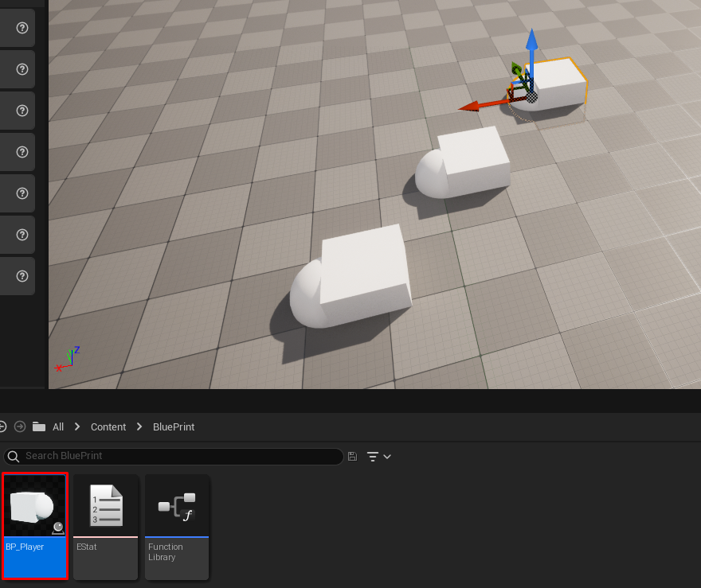

- 이렇게 만들어서 다 같이 관리 될 수 있다.

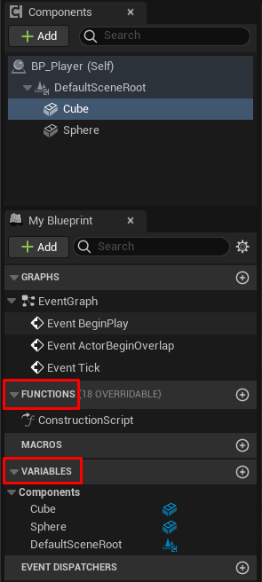

- 멤버 함수와 멤버 변수

# reference with class 

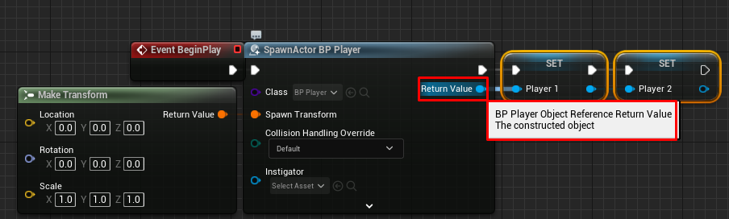

- 각기 다른 객체가 생성되는 것이 아니라 생성된 객체를 참조하는 변수가 두개인거다.

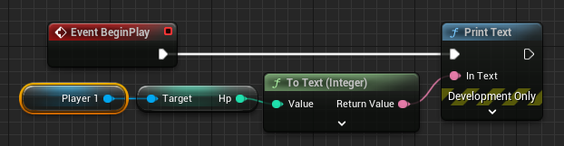

- 초기화를 하지 않은 상태에서 해당 변수를 찌르면 초기값이 나오는게 아니라 런타임 에러가 나온다.(변수가 저장하는 것이 객체가 아니라 객체의 주소 라는 것)

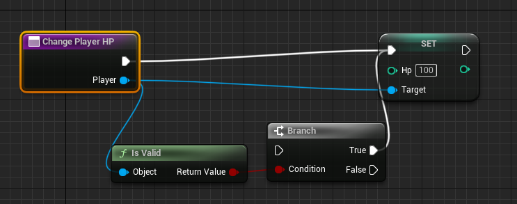

- 함수로 객체의 주소를 넘겨받는 경우에 반드시 널체크 해야 한다.(여기선 isvalid란 노드가 있다)

# monster vs player

`monster member function`

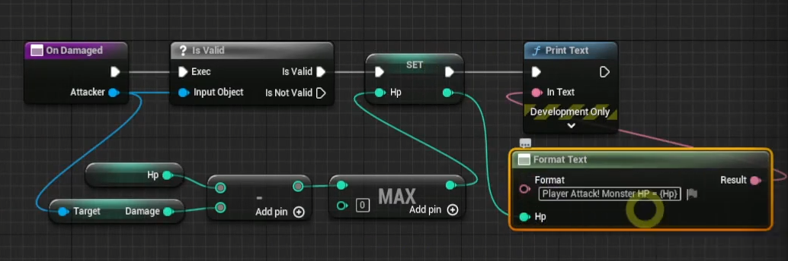

`player member function`

- same with above
- damage 함수를 만들어도 되지만 on damaged를 만드는게 경험적으로 좋음

`level print`

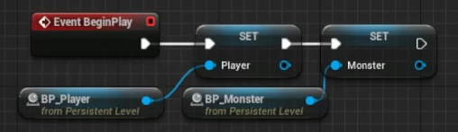
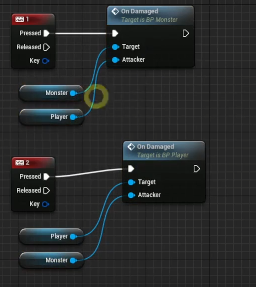

- 이미 레벨에 spawn해 놓은 것들에 대한 객체를 가져올 수 있다.

# 객체 지향

`상속성`

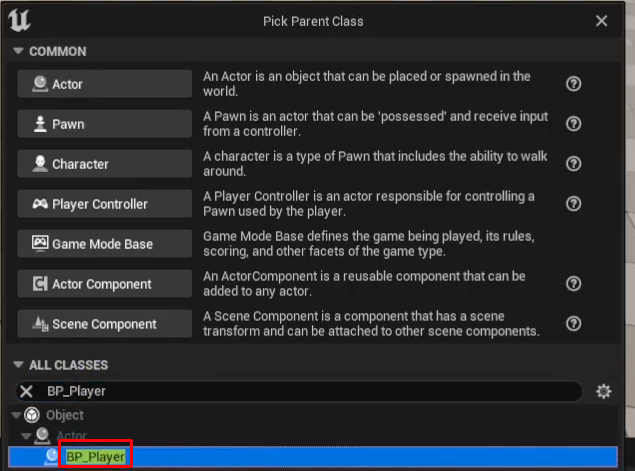

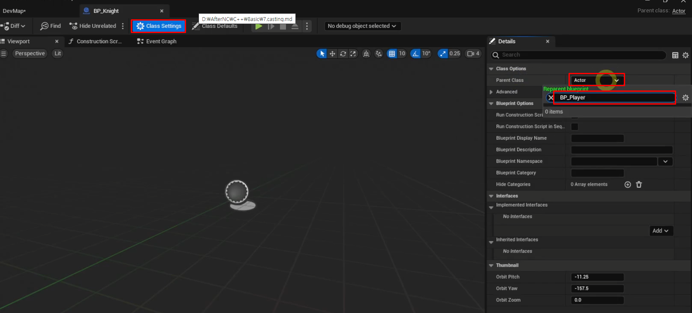

- 만들때 상속받아 만드거나 만들고 나서라도 셋팅해주면 된다.

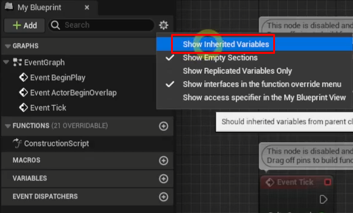

- 자식 클래스에서 부모 변수 보고 싶으면 체크!

`캐스팅`

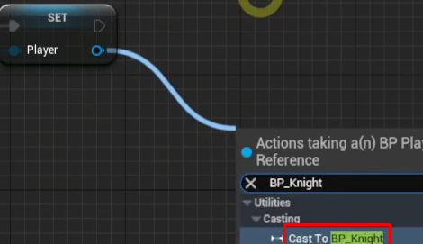

- 상속을 이용하면 부모 객체로 관리하기가 쉬움. 하지만 차별점을 주려면 부모의 함수를  오버라이딩 하던가, 형변환을 통해 각 자식의 멤버함수와 변수에 접근하게 해서 제어해야 한다.

`은닉성`

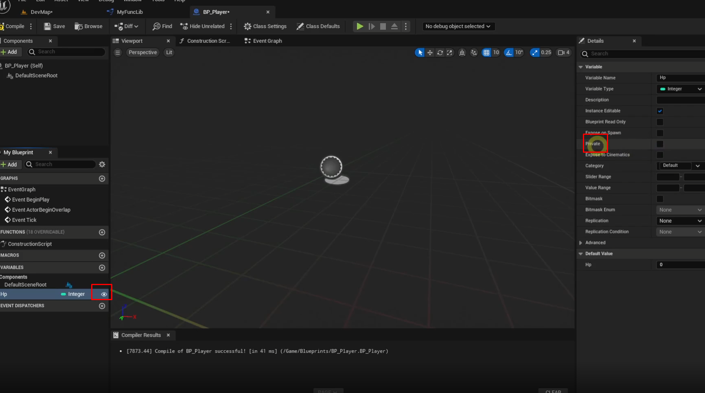

- 왼쪽의 눈알은 툴 에디터에서 보이게 할지 말지 결정하는거고, 오른쪽에 있는게 내가 알고 있는 private이다. 맴버 변수 뿐만 아니라 함수들도 지정할 수 있다.

`다형성(overwirte)`

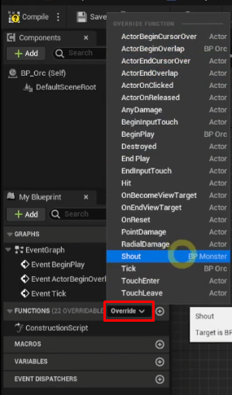

- 부모에 있는 함수를 재정의 할 수 있다.(블루프린트에서는 virtual 키워드 없이 가능)

`interface`

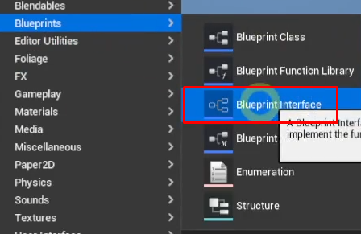

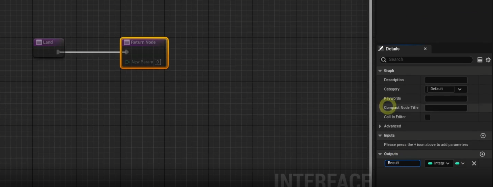

- 구현은 할 수 없고 인자와 리턴 타입만 지정할 수 있다.

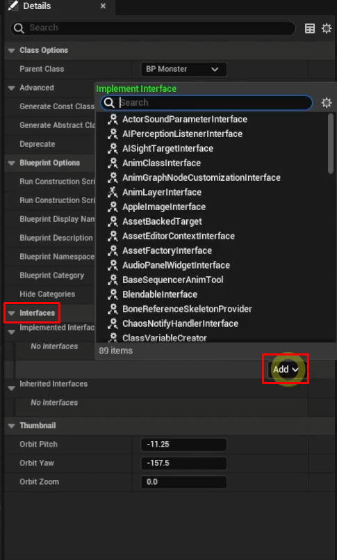

- 블루프린트에서는 부모 상속은 하나만 인터페이스는 여러개 상속받을 수 있다.

# 이벤트와 함수의 차이

이벤트는 다른 스레드에서 되는 듯? 이벤트에서는 delay 함수를 쓸 수 있는데 함 수 에서는 못쓰게 막아논 것을 보고 유추