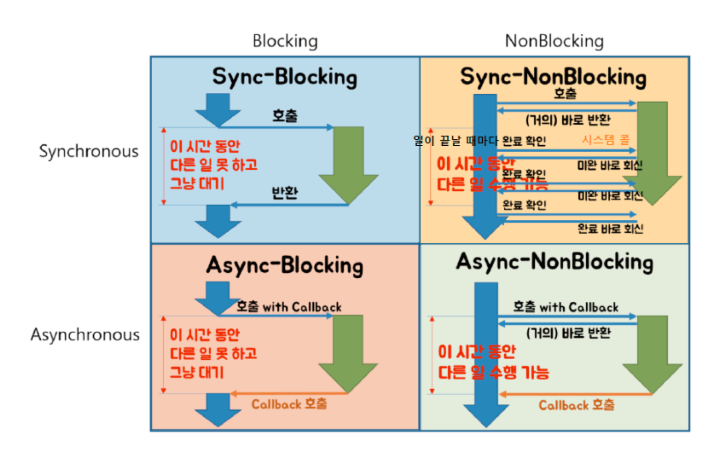

# block nonblock, sync async 

- block nonblock은 B가 해당 작업을 다 처리할때까지 기달릴것인지 말 것인지, sync async는 B의 결과를 요청한 A가 받아서 처리할 것인지, 아니면 B가 처리할 것인지.

소켓을 예로 들어보자. 소켓에서 말하는 nonblock, async는 위에서 말한 것과 1:1로 매칭되진 않는다.

`default(block)`

- block+sync로 작동한다.
- send를 했을때 sendbuffer에 원하는 양의 데이터를 넣을 공간이 없다면 빌때까지 기다린다.
- recv의 했을때 recvbuffer에 데이터가 없을 경우 기다린다.
`nonblock 설정`

- 가능할경우 block+sync로 불가능할 경우 nonblock+sync로 작동한다.
- sendbuffer에 일부라도 공간이 있다면 send를 통해 sendbuffer에 copy하고, 아예 못할시에(sendbuffer가 다 참) wouldblock과 함께 바로 return한다. select를 통해 언제 sendbuffer가 비는지 알 수 있으므로 application layer sendbuffer에 보관하고 있다가 이때 다시 send 요청을 하면 된다.(어? select를 쓰면 그럼 항상 비어 있는 시점을 알 수 있으므로 block 소켓을 사용하면 되지 않을까? 근데 얼만큼 비어있는지 알 수 없으므로 그 이상 send를 해 버리면 또 block 되어 버리기 때문에 nonblock을 사용)
- recvbuffer에 데이터가 있다면 recv로 recvbuffer로부터 통해 데이터를 가져오고, 하지 못하더라도(recvbuffer가 빔) wouldblock과 함께 바로 return한다. recvbuffer에 데이터가 오는 순간 select를 통해 알 수 있으므로 이때 다시 recv를 하면 된다.
- block과 다른 점은 할수 없을때 마냥 기다리는게 아니라 바로 리턴해 버리고 다시 호출해야 한다는 것이다.

`overlapped 설정(async 설정)`

- 가능할 경우 block+sync로 불가능 할 경우 nonblock+async로 작동한다.
- 가능할 경우 동작 매커니즘은 위 `nonblock 설정` 부분과 같으므로 다시 설명하지 않겠다.
- send의 경우 일을(sendbuffer로 copy) 할 수 없을 경우 바로 nonblock되어 빠져나온다.(wouldblock이 아니라 iopending을 뱉음) 하지만 이 일을 하기 위해 다시 send를 하는 것이 아니라 일을 맡기는 것이다. 해당 일을 할 수 있을때(sendBuffer가 빌때) 해당 작업을 완료한 뒤에 우리가 원하는 방식으로 완료통지를 해 준다.
- recv의 경우 일을(recvbuffer로부터 copy) 할 수 없을 경우 바로 nonblock되어 빠져나온다.(iopending을 뱉음) 그리고 해당 일이 가능 할때(recvbuffer에 데이터가 있을때) 해당 작업을 완료 한 뒤에 우리가 원하는 방식으로 완료통지를 해 준다.

# overlapped io(비동기) 고찰

- 비동기 적으로 처리시 여러 io작업을 병렬 적으로 하는 것도 좋지만, tcp의 송신 수신 버퍼를 경유하는게 아닌, 내가 마련한 버퍼로 데이터가 들어오거나 나간다(복사 줄이기)
- 이렇게 좋은 비동기 처리를 하기 위해서 일부로 일을 할 수 없게 만드는 상황을 만들 수 있다. send의 경우는 송신 버퍼를 0으로 만들면 되고(100%) recv의 경우에는 송신 버퍼에 데이터가 있기 전에 recv를 걸기 위해 항상 걸어 놓아 비동기 확률을 높일 수 있다.
- 근데 이렇게 비동기로 하면 진짜 성능이 좋을까? 문제가 하나 있다. 비동기 시에 내가 마련한 버퍼가 page 단위로 lock이 걸리는데 이게 빈번히 걸리면 성능에 큰 영향을 준다는 것이다. non-page-pool 용량문제도 있기는 하지만 이것은 버퍼를 최대한 페이지 단위로 모은다거나 하는 방법으로 해결 할 수 있다.(이것도 굉장히 번거로운..)
- 그래서 아예 비동기 작업이 안 일어나도록 항상 작업이 가능하도록 셋팅하기도 한다. send야 송신 버퍼가 다 찰 확률은 거의 없으니 대부분 동기적으로 일어나게 default로 놔두고, recv의 경우에는 받는 크기를 zero로 놓고 iocp로 신호가 오면(완료통지 방식으로 iocp 선택시)그때 recv를 하는 방식을 택하기도 한다.(이땐 동기로 작동) 근데 이렇게 셋팅해 놓고 이게 비동기 적으로 일어난다고 착각하는 사람이 있다. 이렇게 셋팅하면 overlapped io는 그냥 완료통지 방식으로 iocp를 사용하기 위해 사용하게 되는 것이다.
- 무조건 비동기가 안 좋아, 무조건 동기가 좋아가 아닌 서버 상황에 따라 다르다. 내가 만든 recv 구조는 항상 recv를 거는 구조였는데, 사실 이건 비동기로 걸리더라도 pagelock이 그리 빈번히 걸릴 것 같진 않다. 즉, iocp를 사용하는 상황에서 사용할만 한 것 같다. 그리고 내가 만든 send도 할당된 패킷이 recvring buffer를 거치지 않고 해당 패킷들을 그대로 send하는 방식인데, 한 소켓에 그렇게 몇백개의 패킷을 send 할 일은 없기 때문에 recvringbuffer를 경유 시켜 lock걸리는 빈도를 줄이거나 아예 다 집어 치우고 동기적으로 갈지는 생각해 봐야 할 것 같다.
- 결론은 비동기를 사용하면 userbuffer를 사용하게 되고 그럼 pagelock이 걸리며 성능에 영향이 가니 빈도가 너무 높다면 이를 줄이는 방안을 생각해보던지(recvringbuffer 사용) 어? 그러게 비동기적으로 중첩해야 할 상황이 많지 않을 것 같은데?(이걸 근데 어케암..)하면 tcp 버퍼에 한번 더 복사되는 것 감안하더라도 아예 동기로 가는 것도 방법이다. recv의 경우 overlapped io를 사용하면 send와 달리 거의 항상 비동기로 걸려(항시 걸기 때문에) 선택권이 없는 것 아닌가?(send의 경우 sockopt 조정하여 동기로 갈지 비동기로 갈지 결정) 유저가 최악의 경우로 패킷을 때려 박아도 유저가 마련한 연속적인 바이너리 버퍼에 한번에 담기 때문에(아닐 시에는 위 고민들 해봐야 함) 크게 상관 없을 듯 하다. 
- 결론 비동기 되면서 pagelock 없는 것 없음?
- 없다면, 비동기로

# overlapped 구조체
- 여기 내부에서 사용할 것은 크게 없는 듯 하나. 반드시 비동기 요청 전 초기화가 된 후에 같이 던져야 하며, 완료통지 시에 이 구조체의 포인터가 오기 때문에 구조체를 상속받는 무언가를 만들어 뒤에 원하는 정보를 더 낑겨 넣을 수도 있다.
- 전달되는 overlapped 구조체와 버퍼는 비동기 작업동안 옮겨지거나 삭제되면 안 된다. 그대로 보관하고 있어야 한다.(스택에 놔두는 거 조심) 포인터를 전달하기 때문에 디바이스 드라이버에서 직접 해당 메모리를 건든다.
- 각각의 요청은 자신만의 overlapped 구조체를 가지고 있다.

# io copmletion port
- 싱글스레드 구조에서 클라이언트의 요청을 하나의 스레드가 받아 요청까지 처리한다면 그동안 다른 클라이언트 요청은 대기 상태가 되는 것이다.(시리얼 모델) 그래서 하나의 스레드가 클라이언트의 요청을 받고 그 요청에 대한 처리는 다른 스레드에게 맡기고 바로 다른 클라이언트의 요청을 받기 위해 대기 상태로 빠지는 방법이 다수의 클라이언트 상태로는 더 좋다.(컨커런트 모델) 근데 이렇게 해도 생각보다 많은 성능적 이점을 기대하긴 어렵다. 너무나 많은 스레드가 생성되어 컨텍스트 스위칭이 벌어지기 때문이다. 그래서 나온 것이 iocp다.

`devicelist`

- CreateIOCompletionaPort를 통해 IOCP를 생성하면 내부엔 다음과 같은 컨테이너들이 생긴다. 그리고 다시 CreateIoCompletionPort를 통해 특정 장치와(소켓 등) 연동을 하게 되면 deviceList에 새로운 항목을 추가한다. 해당 항목은 장치 핸들과 연동할때 같이 넣은 CompletionKey(값의 의미는 사용자 맘대로다)로 구성된다.

`io completion queue`

- 특정 장치에 대한 비동기 요청이 완료되면, 해당 장치와 연동된 iocp의 io completion queue에 완료통지를 나타내는 항목을 삽입한다. 항목은 송수신된 바이트 수, 연동시 키값, 비동기 io 요청시 사용했던 overlapped 구조체, 에러코드로 구성되어 있다. gqcs를 통해 해당 항목을 꺼낼 수 있다. 
- PostQueuedCompletionStatus를 통해서도 io completion queue에 데이터를 넣을 수 있다.
- overlapped 구조체에 특정 설정을 하여 비동기 요청을 하면 devicelist에서 io completion queue로 이동하지 않는다.(보내주고 후처리 필요 없을 경우)
- 또 특정 설정을 하면(FILE_SKIP_COMPLETION_PORT_ONSUCCESS) 동기적으로 일어나는 것에 대해서는 io completion queue로 이동하지 않을 수 있다.(일관성 vs 성능)
- FIFO 방식이다.

`waiting thread queue`

- gqcs를 호출하면  스레드의 id 값이 waiting thread queue에 삽입된다. io completion queue에 데이터가 있고 release thread queue의 size가 사용자 지정 스레드 개수보다 작을 경우 iocp가 스레드를 깨워 release thread list로 옮긴다.
- LIFO 방식이기 때문에 성능 관점에서 좋다.

`release Thread list`

- io 작업이나 스레드가 멈추는 경우 paused Thread list로 빼 주고 있고 재개시 다시 돌아올 수도 있기 때문에 사용자가 지정한 것 보다 더 많이 들어올 수 있다. 그럴 경우 waiting thread queue에서 더 이상 꺼내지 않는다.
- gqcs를 호출하면 다시 waiting thread queue로 간다.

`paused Thread list`

- io 작업이나 스레드가 멈췄을 경우 여기로 이동되고 재개되면 다시 release thread list로 이동한다.

`정리`
- 단순 스레드 풀의 개수를 지정해 놓고 그 개수를 최대로 도는 것이 아닌, 스레드가 잠시 멈추는 것까지 고려해서 실제 돌아가는 놈들의 개수를 맞출 수 있게 했다. 그래서 max 스레드 개수는 내 코어 개수와 자본을 얼마나 사용할건지에 따라서 지정해주고 실제 workerthread의 개수는 그 보다 많게, 멈춘 스레드까지 고려되어 유동적이게 갯수 조절이 되도록 지정 되어야 한다.

# io cancel
- 해당 장치를 닫으면 스레드와 상관없이 관련된 io 요청은 전부 취소한다.
- 이전 윈도우 버전에서는 특정 스레드에 의해 삽입된 io 요청들은 해당 스레드 종료시에 모두 취소되어 스레드는 io요청들이 완료 되어야 한다면 그때 까지 살아 있어야 했지만, 최신 버전은 io요청만하고 스레드가 종료되어도 io 작업은 계속 수행 된다.
- `cancelIO(HANDLE hFile)` 이 함수를 호출한 스레드가 삽입한 모든 io 요청을 취소할 수 있다.(iocp에 등록된 장치가 아니라면)
- `cancelIOEx(HANDLE hFile, LPOVERLAPPED pOverlapped)` 이 함수를 호출하면 해당 장치에 overlapped에 해당하는 요청을 cancel할 수 있다. 스레드에 종속적인 개념이 아님. A 스레드에서 요청한 것을 B스레드에서 지울 수 있는것 overlapped에 Null을 넣으면 해당 장치가 요청한 모든 요청을 cancel 시킨다. 각 스레드는 해당 장치에 대한 요청을 취소하게 된다. 

# 생각난

- workerthread를 단순 io 스레드 용도로 사용하면 그렇게 많은 스레드가 있을 필요가 없다.

